# Demo Day のための発表準備メモ

作成日: 2026-07-31<br>
対象ブランチ: `PUYO-181/orchestration-gui-demo`<br>
デモ実装の基準 commit: `21037cf43fce6f5015def58d2bce7f9d03db7c84`<br>
Draft PR: [#93 `[PUYO-181] 強化学習オーケストレーションのGUIデモを構築する`](https://github.com/shhchan/puyo-ai-dev-platform/pull/93)

この文書は、今日の発表内容、スライド構成、図の素材、会社 PC でのデモ再現手順を一つにまとめた引き継ぎ資料である。会社 PC の Claude へは、この文書を主資料として渡せばよい。

## 最初に押さえる結論

今回作ったものを一文で表すと、次のようになる。

> ぷよを置く場所そのものを強化学習に丸投げせず、盤面を分析して「本線を伸ばす・催促する・相殺する・発火する・生き残る」などの戦術と探索予算を選ぶ、学習可能なオーケストレーション基盤を作った。

発表の中心は「現時点で最強のぷよぷよ AI ができた」ではない。「人間が if 文で戦術切替をすべて記述する構造から、戦術の選択とパラメータを学習可能な境界へ切り出した」が中心である。

今日の GUI デモで確実に示せるのは、次の範囲である。

- 盤面分析、8 戦術の候補化、学習済み manager による arbitration、Planner、探索 worker、リアルタイム操作、GUI の一連の接続
- GUI 上で active pair が移動・回転・落下・接地し、AI が通常のゲーム入力と同じ時間軸で動くこと
- 選択戦術、選択理由、objective、plan、予測連鎖、予測攻撃などの診断表示が更新されること
- 固定 seed のリプレイを最終状態 hash まで再検証できること

今日の GUI デモだけでは、次のことは証明していない。

- 現在の v1.7.2 manager が十分に強いこと
- 大連鎖を安定して構築できること
- PUYO-130 の mixed-opponent PPO 学習が完了していること
- learned CandidateRanker が実装済みであること
- PUYO-176 canonical gate の正式な `GO` / `GO_WITH_LATENCY_WAIVER`
- realtime latency、promotion、release の品質基準を満たしたこと

## 私のこれまでの歴史について

ぷよぷよ AI 開発のモチベーション自体は以前から結構あった。発表では、ぷよぷよとはそもそも何なのかという話も必要かもしれない。

元々は連鎖探索のアルゴリズムに興味があった。ぷよぷよというゲームの性質として、組ぷよが操作中のぷよを含めて最大 3 手しか見えない中で、将来的に大きな連鎖になるような探索が必要になる。

探索空間が大きく全探索は不可能なので、ビームサーチを活用するようにした。ただ、探索しようとしても見えている次の手は最大 3 手なので、正確な探索は深さ 3 までしか行なえず、遠い未来にある大きな連鎖を目指すような探索は難しい。

そこで、深さ 4 以上の手をランダムで生成して、より多くのありうる世界線で大きな連鎖を作れる序盤の手のスコアを高めるような探索をするようになった。これによってある程度の連鎖数、10 連鎖くらいは作れるようになったが、それより大きな連鎖を安定して探索できるようになるにはさらなる工夫が必要で、職人技になる。

ある日、Ama というぷよぷよ AI が登場して世間をざわつかせた。平均 14 連鎖程度組め、上振れると 17 連鎖をたたき出すこともある。ぷよぷよの連鎖数理論値は 19 連鎖であり、ビームサーチの品質という観点でかなりの高みに至っていた。

しかも、Ama は相手の行動をもとに「対応」をすることもでき、結構的確に相手の攻撃へ対応できる。戦術がいろいろなパターンでハードコードされていて、対人間の対戦でもかなりの強さを誇る歴代最強クラスの AI になった。

そういった非常に強いぷよぷよ AI が登場して、自分の開発意欲は一度なくなってしまった。

ただ、戦術をハードコードしているというところがどうしても気になった。それは AI というよりも、高品質な連鎖探索アルゴリズムと、あらかじめ決められた対人間向けルールに基づいて動く bot なのではないか、と感じた。

元々、自分が強化学習に興味を持っていたので、それをうまく使って、戦術の部分をもっとハードコードしないロマンのあるものにできないかと思い、今回の開発を始めた。

### この導入をスライドにするときの注意

Ama の平均連鎖数、最大連鎖数、実装思想、歴代最強という表現は、このリポジトリ内で検証した事実ではなく、発表者自身の知識・観察に基づく。社外へ残る資料にする場合は、Ama の公開資料や動画など別の出典を付ける。「Ama と同じものを再実装した」とは言わず、「固定ルールで戦術を切り替える強い AI を見て、戦術選択を学習対象にしたくなった」という開発動機として述べる。

## ぷよぷよ AI の問題を短く説明する

エンジニア向けには、次の 4 点を最初に共有すると後の設計を理解してもらいやすい。

1. 盤面は横 6 列で、2 個 1 組のぷよを移動・回転して置く。
2. 同色が 4 個以上つながると消え、落下後に再び消えると連鎖になる。攻撃量は連鎖によって大きく増える。
3. 空盤面でも組ぷよ 1 手の置き方は最大 22 通りある。これが深さごとに分岐するため、素朴な全探索は急速に大きくなる。
4. 確定して見えるのは current と NEXT 2 組までである。大連鎖にはさらに先の不確実なツモを仮定した長期探索が必要になる。

発表用の短い表現は「局所的には 22 択、長期的には組合せ爆発、しかも 4 手目から未来が不確実」でよい。

## どんなものを作ったか

### 設計上の決断

「盤面から 22 通りの設置位置を直接 PPO に選ばせる」のではなく、判断を二つの階層に分けた。

- 上位の manager は、局面に応じた戦術、目標、探索予算を選ぶ。
- 下位の探索 worker は、その目標に沿って合法手を探索し、具体的な設置位置を返す。

これにより、ビームサーチが得意な「候補手を掘る能力」を捨てずに、人間が if 文で書いていた「いつ何を狙うか」を学習対象にできる。強化学習の action は直接の左・右・回転ではなく、戦術・戦術パラメータ・探索予算である、というのが一番重要な設計思想である。

### 実行時のデータフロー

```mermaid
flowchart LR
    A[対戦状態<br/>自他盤面・NEXT・予告おじゃま] --> B[StateAnalyzer]
    B --> C[局面特徴<br/>危険度・攻撃予測・本線・対応期限]
    C --> D[8 戦術の適用可否]
    D --> E[Learned Strategy Manager<br/>候補 logit・value・risk・parameter]
    E --> F[上位 K 戦術を Planner preview]
    F --> G[Final arbitration<br/>戦術と予算を決定]
    G --> H[StrategyOrchestrator]
    H --> I[探索 worker<br/>build / counter / punish / fire / survival]
    I --> J[K-best 設置候補]
    J --> K[候補選択<br/>現状は compatibility rank 0]
    K --> L[NTurnPlan の先頭設置]
    L --> M[RealtimePolicyController]
    M --> N[移動・回転・落下を GUI に入力]
```



実装上は、`StateAnalyzer` が局面を診断し、tactic registry が 8 戦術の定義と適用条件を提供する。learned manager は軽量な候補評価を行い、上位の戦術だけ実際の Planner で preview した後に最終選択する。選択された戦術は既存の探索 worker へマッピングされ、worker が具体的な置き場所を提案する。GUI 側では、その設置結果へ瞬間移動せず、Realtime Controller が左右移動・回転・落下の tick 列へ変換する。

主な実装:

- [agents/state_analyzer.py](agents/state_analyzer.py): 自他盤面、攻撃可能性、危険度、予告おじゃま、相殺・返し可能性などを診断
- [train/config/v1_7_tactic_registry.yaml](train/config/v1_7_tactic_registry.yaml): 8 戦術、適用条件、目的、制約、探索パラメータ、fallback の正本
- [agents/v1_7_strategy_manager.py](agents/v1_7_strategy_manager.py): learned manager、特徴量、parameter decoder、planner preview、final arbitration
- [agents/v1_7_analyzer_manager.py](agents/v1_7_analyzer_manager.py): 同じ Analyzer と 8 戦術を使う解釈可能なルール baseline
- [agents/v1_7_planner.py](agents/v1_7_planner.py): 戦術パラメータから具体的な PlannerRequest を構築
- [agents/strategy_workers.py](agents/strategy_workers.py): worker、SearchProposal、NTurnPlan、StrategyOrchestrator
- [eval/realtime_versus_ui.py](eval/realtime_versus_ui.py): AI の設置判断を実時間の操作として描画
- [eval/v1_7_orchestration_demo.py](eval/v1_7_orchestration_demo.py): PUYO-181 の準備、QA、検証、live 実行をまとめた入口

### 8 種類の戦術

| tactic id | GUI/日本語 | 目的 | 対応する探索 worker |
|---|---|---|---|
| `build_main` | 本線構築 | 将来の大連鎖、発火点、継続性を保ちながら本線を伸ばす | `build_large` |
| `prepare_response` | 対応準備 | 相手の短期攻撃や予告おじゃまに備え、返せる形を作る | `counter` |
| `counter_or_return` | 相殺・返し | 着弾期限までに相殺し、可能なら余剰攻撃を返す | `counter` |
| `pressure` | 催促 | 相手が不安定なとき、短期攻撃で対応を迫る | `punish` |
| `lethal_attack` | 必殺攻撃 | 相手の耐久を超える攻撃を期限内に作る | `punish` |
| `all_clear` | 全消し運用 | 全消し権利を保持するか、攻撃へ使うかを判断する | `fire_max` |
| `fire_main` | 本線発火 | 本線を発火して現在の攻撃を確定する | `fire_max` |
| `survive` | 生存優先 | 窒息を避け、着弾後も置ける盤面を残す | `survival` |

registry には戦術名だけでなく、たとえば `build_main` の目標連鎖数、将来価値の重み、形の重み、危険許容度、発火点を保存するか、beam depth / width、候補数、latency budget まで定義されている。manager は「戦術ラベル」だけでなく、この有界なパラメータ群も出力する。

### learned manager の中身

v1.7.2 の checkpoint が保持する特徴 contract は次の構成である。

- 局面 context: 77 次元
- 戦術ごとの特徴: 56 次元
- Planner preview: 23 次元
- 戦術数: 8
- hidden dimension: 64

ネットワークは、共有 context encoder と戦術ごとの head を持つ。各戦術 head は最初に以下を出力する。

- `proposal_logits`: どの戦術を詳しく preview するか
- `value`: 戦術の価値推定
- `risk`: 戦術の危険度推定
- `parameter_logits`: 戦術の objective、constraint、planner parameter

その後、候補上位 `preview_top_k` 件に対して実際に探索 worker を動かし、予測連鎖数、予測得点、予測攻撃、危険度、探索 node 数、deadline 達成可否などを取得する。final arbitration head が、軽量推論結果と preview 結果を合わせて最終戦術を選ぶ。

これは「ニューラルネットが全探索を置き換える」のではなく、「高価な探索をどの目的・予算で使うかをニューラルネットが調停する」構造である。

### 用語集

| 用語 | このプロジェクトでの意味 |
|---|---|
| Strategy Manager | 局面から戦術、パラメータ、探索予算を選択する上位方策 |
| StateAnalyzer | 盤面から即時・短期攻撃、危険度、本線、予告おじゃま、対応期限などを算出する決定論的解析器 |
| tactic | 本線構築、催促、相殺など、「何を達成したいか」の意味的な選択肢 |
| worker | tactic の目標を受け、具体的な設置候補を探索するアルゴリズム |
| PlannerRequest | objective、constraint、beam depth / width、候補数、期限などをまとめた探索要求 |
| proposal | worker が返す設置候補、予測連鎖・攻撃、危険度、理由、探索統計 |
| arbitration | 複数の戦術候補と preview を比較して最終的に一つを選ぶ処理 |
| behavior cloning / BC | teacher が選んだ戦術やパラメータを教師あり学習で模倣する初期学習 |
| PPO | 現在方策と更新後方策の差を制限しながら、対戦報酬で方策を更新する強化学習アルゴリズム |
| curriculum | 本線構築、相殺、催促、生存、通常対戦の順に課題を段階化する学習方法 |
| CandidateRanker | worker が返した複数の具体手を、局面横断で学習して並べ直す将来コンポーネント |
| paired sides | 同じ seed で先後を入れ替えて 2 局行い、先手・後手の偏りを減らす評価 |

## どうやって学習したか

このプロジェクトには「既に実施した旧 manager の PPO 学習」と、「今日の GUI に使う v1.7.2 bootstrap checkpoint」の二つがある。ここを混ぜずに説明する必要がある。

### 1. 既に実施した 6 worker manager の BC + curriculum PPO

旧 manager では、上位 action を次の 6 profile とした。

- `build_large`: depth 6 / width 32 で大連鎖構築
- `build_budget`: depth 3 / width 16 で計算量を抑えた構築
- `punish`: 相手へ刺さる最小攻撃を探す
- `counter`: 期限内に incoming を相殺・返却する
- `fire_max`: 1 手で最大攻撃を発火する
- `survival`: 窒息リスクと盤面形状を優先する

学習は次の順で行った。

1. 典型的な戦術局面を作る。
2. 同じ局面で全 worker を counterfactual に実行し、「別の worker を選んでいたらどうなったか」を比較する。
3. teacher が選んだ worker を behavior cloning して初期方策を作る。
4. `chain_construction`、`deadline_counter`、`punish`、`survival`、`full_match` の curriculum PPO で対戦報酬へ適応させる。
5. 固定 worker、ルール manager、greedy、旧 checkpoint、標準 beam と同じ seed・先後入替で比較する。

PPO の主な設定は `gamma=0.99`、`GAE lambda=0.95`、clip `0.2`、entropy coefficient `0.01` である。戦術を頻繁に切り替えることへの penalty、判断時間 penalty、探索 cost、戦術成功の auxiliary reward も持つ。通常対戦へ近づくほど auxiliary reward を弱め、最終的には試合結果へ寄せる。

根拠:

- [agents/manager_ppo.py](agents/manager_ppo.py)
- [train/config/manager.yaml](train/config/manager.yaml)
- [docs/development/puyo-strategy-orchestration.md](docs/development/puyo-strategy-orchestration.md)

### 2. 旧 manager の実測結果

2026-06-13 に CPU 8 worker で medium 9,984 step、続けて long 99,328 step を実行した。long は 2,378 episode、所要時間は 3 時間 42 分だった。

同じ 50 seed を先後入替した各 100 局の主な結果は次の通りである。`score rate` は引き分けを 0.5 として policy A の成績を集計した値であり、異なる対戦相手間の絶対的な強さの順位ではない。

| opponent | score rate | 95% CI | 平均最大連鎖 | 平均判断時間 |
|---|---:|---:|---:|---:|
| 旧 PUYO-28 checkpoint | 0.94 | [0.893, 0.987] | 4.98 | 1287.9 ms |
| rule manager | 0.50 | [0.402, 0.598] | 2.73 | 686.4 ms |
| worker large | 0.81 | [0.733, 0.887] | 2.90 | 710.0 ms |
| worker quick | 0.34 | [0.247, 0.433] | 2.06 | 779.1 ms |
| worker counter | 0.95 | [0.907, 0.993] | 4.98 | 1040.0 ms |
| greedy | 0.88 | [0.816, 0.944] | 2.94 | 746.0 ms |
| PUYO-29 beam | 0.81 | [0.733, 0.887] | 2.87 | 751.6 ms |

標準 beam 戦では `build_large=1,259`、`punish=854`、`survival=244` が選ばれており、一つの worker へ完全固定されたわけではない。一方で worker quick には 0.34、判断時間は平均 0.69〜1.29 秒である。したがって「戦術切替が学習できた」という証拠にはなるが、「すべての相手より強い」「実時間制約を解決した」とは言えない。

集計の正本:

- [docs/benchmarks/puyo-51-summary.json](docs/benchmarks/puyo-51-summary.json)
- [docs/benchmarks/puyo-51-arena-summary.csv](docs/benchmarks/puyo-51-arena-summary.csv)

### 3. 今日の GUI デモ用 v1.7.2 checkpoint

今日の primary デモは上記 long PPO checkpoint をそのまま使っていない。v1.7 の Analyzer、8 戦術 registry、学習 head、Planner の接続を再現するため、リポジトリに含まれる smoke dataset から deterministic な behavior-cloning checkpoint を生成する。

設定:

- seed: 126
- epoch: 20
- hidden dimension: 64
- device: CPU
- dataset: 29 current-schema samples
- 重複除去: 6 records
- train / validation: 3 / 26 samples
- analyzer scenario: 24 cases

結果:

- Analyzer 固定 scenario: 24/24 pass
- validation の proposal tactic accuracy: 14/26 = 0.5385
- validation の final arbitration tactic accuracy: 14/26 = 0.5385
- 24 scenario に対する model tactic accuracy: 13/24 = 0.5417
- validation parameter mean normalized error: 0.2272

この dataset はパイプラインの schema、checksum、学習、保存、再読込を確認する smoke 用であり、train が 3 samples しかない。したがって、この精度をモデル品質の根拠にはしない。発表では「GUI へ通すための bootstrap checkpoint」「学習可能な経路の配線確認」と呼ぶ。

学習 loss は以下の和である。

- lightweight tactic classification
- Planner preview 後の final arbitration classification
- value prediction
- risk prediction
- tactic ごとの bounded parameter prediction

設定と実装:

- [train/config/v1_7_manager_bootstrap.yaml](train/config/v1_7_manager_bootstrap.yaml)
- [train/train_v1_7_manager.py](train/train_v1_7_manager.py)
- [docs/development/puyo-v1-7-manager-bootstrap.md](docs/development/puyo-v1-7-manager-bootstrap.md)

本格的な v1.7 mixed-opponent PPO は後続の PUYO-130 であり、今日の時点では未実施である。PUYO-176 の smoke-only 結果も canonical gate 完了ではなく、正式な `GO` 判定には使わない。

## ルール baseline と learned manager の違い

`manager_rule` は、incoming、lethal、危険度などの固定条件から 6 worker のどれを使うか決める解釈可能な baseline である。発表上は「戦術の選択順序まで人間が決めた場合」の対照として使える。

`v1_7_analyzer_manager` は、より新しい StateAnalyzer と 8 戦術 registry を使うが、最終選択は固定 priority band によるルールである。今日の primary preset では、learned `v1_7_bootstrap_manager` の相手がこの `v1_7_analyzer_manager` になっている。

したがって、以下の言い分けが正確である。

- `manager_rule`: 旧 6 worker を固定ルールで選ぶ baseline
- `v1_7_analyzer_manager`: 新 8 戦術を固定ルールで選ぶ baseline
- `v1_7_bootstrap_manager`: 新 8 戦術を learned head と Planner preview で選ぶ今日の 1P

`manager_rule` は Ama の実装そのものではない。人間が用意した条件で戦術 worker を切り替えるという考え方を比較するための、プロジェクト内 baseline である。

## デモ

### デモで伝えるメッセージ

> 今日は強さや大連鎖を見せるのではなく、盤面を見て戦術を選び、戦術に応じた探索を行い、その結果を通常のゲーム操作へ変換できるところまで接続したことを見せる。

GUI では以下を指し示す。

1. active pair が左右移動・回転・落下・lock する。設置位置へ瞬間移動していない。
2. `tactic` と `why` が、現在の戦術と選択理由を示す。
3. `obj` が target、incoming、deadline などの目的を示す。
4. `plan` が planner の計画識別子と更新を示す。
5. `w c... a...` が worker の予測連鎖数と予測攻撃量を示す。
6. 連鎖やおじゃまが解決すると表示が更新され、ゲーム終了時は winner banner が出る。

### primary preset

```bash
.venv/bin/python -m eval.v1_7_orchestration_demo live --preset primary
```

- 1P: `v1_7_bootstrap_manager` v1.7.2
- 2P: `v1_7_analyzer_manager` v1.7.0
- seed: 126
- max ticks: 7200
- speed: 1.0
- 最初の 30 秒を GIF に記録

手元で保存していた基準 QA は 3,033 ticks で game over まで完走し、playability gate を通過している。1P は 32 decisions、2P は 20 decisions、score は 897 対 227、winner は 2P、総 generated attack は 12 だった。リプレイは 3,033 ticks の全 snapshot を再生し、期待した final hash と再検証後の final hash が一致している。

2026-07-31 に GitHub から branch をクリーン clone し、`prepare` から再生成した別の QA も実施した。この run は 2,433 ticks、score 179 対 190、winner は 2P、generated attack は 1 で、両 AI とも timeout 0 / deadline miss 0、playability gate pass、リプレイ final hash 一致だった。これにより、remote branch だけから checkpoint、GIF、replay、manifest を再生成できることを確認した。

同じ seed でも GUI は `latency_mode=measured` で動き、実 CPU の推論完了 tick により入力時刻が変わるため、異なるマシンや再生成した checkpoint で試合の軌跡と score が完全一致するとは限らない。再現性の保証単位は「既に記録した各 replay を、その replay の final hash まで検証できること」である。

どちらの結果も「1P が強い」証拠ではなく、両 AI が連続して操作し、攻撃と終了まで到達する playability の証拠である。

### 固定ルールとの比較を話したい場合

2P を旧 rule manager へ変えることはできる。

```bash
.venv/bin/python -m eval.v1_7_orchestration_demo live \
  --preset primary \
  --opponent manager_rule \
  --max-ticks 10000
```

この custom run は primary の固定 QA とは別ディレクトリに保存される。本番前に会社 PC で一度完走させ、見せたい戦術切替と画面の安定性を確認する。見栄えが不安定なら、検証済み primary へ戻す。

### fallback

checkpoint のロードや learned inference が不安定なら、すぐに以下へ切り替える。

```bash
.venv/bin/python -m eval.v1_7_orchestration_demo live --preset fallback
```

fallback は checkpoint を使わず、1P `v1_7_analyzer_manager` 対 2P `manager_rule`、seed 123 で動く。発表時は「同じ Analyzer、戦術 registry、Planner、worker、GUI 診断を使うルールベース fallback であり、learned policy のデモではない」と説明する。

### 「かえる積み」に見える挙動の原因

`--max-ticks 10000` で観察した 1P の左端積みは、Realtime Controller の timeout や fallback が原因ではなかった。調査した live run では 1P の policy decision は 9 回、fallback 0、timeout 0、unreachable 0、deadline miss 0 であり、Planner が意図的に左寄りの手を返していた。

primary は GUI を止めないため、通常の learned request に対して以下の presentation cap を適用している。

```text
preview_top_k = 1
search_depth <= 1
search_width <= 4
candidate_count <= 2
latency_budget_ms <= 250
```

空盤面の root には 22 通りの合法手があるが、長期探索の root survivor quota と安定 sort の組合せで width 4 が先頭の 4 root action だけで埋まる。先頭は左端付近の設置なので、残り 18 通りが `beam_width` により次の深さへ残らない。さらに depth 1 では current の 1 組しか見ず、NEXT を使った連鎖構築まで評価できない。候補は 2 件に絞られ、learned CandidateRanker がまだないため、現在は `compatibility_rank_0` が先頭候補を採用する。

探索上限を上げれば手は変わる。初期局面の調査では、通常 request に近い depth 5 / width 66 で中央寄りの手になったが、1 decision に約 28 秒かかり、expanded node budget も使い切った。これは 1 組を約 2 秒で操作する realtime GUI には間に合わず、非同期結果が stale になる。

また、現在の `latency_budget_ms` はこの経路では hard timeout ではなく、overrun を記録する観測値である。数値を上げても探索が自動的に賢くなるわけではない。

発表での扱い:

- primary は「オーケストレーションと GUI 配線」のデモとして使う。
- 大連鎖を作れるという説明には使わない。
- 本番中に `--no-planner-cap` を使わない。1 手が数十秒止まりうる。
- depth 2 以上を本番で突然試さない。事前に実機で latency と見栄えを確認する。
- 「計算資源の制約で探索を強く切り詰めたため、今日はプレイの強さより意思決定の可視化を見せている」と先に説明する。

### デモ中の短い話し方

1. 「左が learned manager、右が同じ 8 戦術を固定ルールで選ぶ baseline です」
2. 「上位 AI は直接左右ボタンを選んでいません。盤面から戦術と探索予算を選びます」
3. 「今 `build_main` なら本線構築、`survive` なら生存優先です。選択理由と objective も表示しています」
4. 「選択された worker が設置候補を探索し、最後に通常の移動・回転へ変換しています」
5. 「今日の checkpoint は smoke dataset の BC なので、ここでは強さではなく学習可能な接続を見てください」

## 発表スライドのたたき台

10 分前後を仮定した 10 枚構成。持ち時間が短ければ 6〜7 枚目の定量結果を 1 枚にまとめる。

### 1. タイトル

案:

> 戦術をハードコードしないぷよぷよ AI へ<br>
> 強化学習オーケストレーション基盤を作った

サブタイトルで「Demo Day / 2026-07-31」を入れる。

### 2. なぜぷよぷよ AI は難しいか

- 1 手最大 22 択
- 3 手先までしか確定しない
- 連鎖の価値は長期に現れる
- 全探索は組合せ爆発する

素材: 盤面、current / NEXT / NEXT2、22 分岐から木が広がる簡略図。

### 3. 高品質ビームサーチの先に残った疑問

- 探索を強くすれば大連鎖は作れる
- 相手に応じた「対応」は別の意思決定
- 戦術切替をすべて if 文で書くのではなく、環境から獲得できないか

ここで Ama を見たときの個人的な歴史を話す。

### 4. 問いの立て方

大きく一文:

> 「どこに置くか」は探索へ、「今なにを狙うか」は学習へ

直接 22 action を選ぶ flat policy と、manager + worker の階層構造を左右比較する。

### 5. システム構成

この文書の Mermaid 図をベースに、以下の 5 ブロックへ簡略化する。

`StateAnalyzer → Strategy Manager → Planner → Search Worker → Realtime GUI`

学習箇所である Strategy Manager だけ色を変える。ルールと学習済み部分の境界を明示する。

### 6. AI が選ぶ 8 戦術

8 戦術表をアイコン付きで 2 × 4 に並べる。全部を読み上げず、「構築・対応・攻撃・生存に分けた」と説明する。

### 7. どう学習したか

`全 worker の counterfactual 評価 → behavior cloning → curriculum PPO → paired arena`

教師あり学習と強化学習の役割を色分けする。今日の GUI checkpoint は BC smoke、過去の定量結果は旧 6 worker manager の PPO であることを注記する。

### 8. 結果と現在地

強調する数値:

- long PPO: 99,328 steps / 2,378 episodes / 3 h 42 min
- standard beam に score rate 0.81、95% CI [0.733, 0.887]
- rule manager とは 0.50
- worker quick には 0.34
- 平均判断時間 0.69〜1.29 秒

見出しは「戦術切替はした。しかし、まだ一貫して強くも速くもない」がよい。

### 9. GUI デモ

ライブ画面、または `demo.gif`。HUD の `tactic`、`why`、`obj`、`plan` を吹き出しで説明する。大連鎖ではなく、戦術判断が実際の操作へ接続されているところを見る。

### 10. 今後の展望

- CandidateRanker を学習し、worker 内の K-best 候補を局面横断で選ぶ
- mixed-opponent PPO で v1.7 manager を本学習する
- plan 再利用、先読み、native kernel で realtime latency を下げる
- 人間が列挙した戦術から、戦術表現そのものの獲得・進化へ進む
- プレイヤー模倣と戦術進化を組み合わせ、自分の clone を改善相手にする

## スライド素材の収集

### 最低限集めるもの

1. primary の 30 秒 GIF
2. GUI 全体のスクリーンショット
3. `tactic` / `why` / `obj` / `plan` が読める HUD 拡大スクリーンショット
4. 8 戦術の表
5. architecture 図
6. PPO 学習フロー図
7. benchmark の棒グラフ

### benchmark グラフ用データ

スライドでは対戦相手を絞り、次の 5 本程度の棒グラフにする。

| opponent | score rate |
|---|---:|
| previous manager | 0.94 |
| manager rule | 0.50 |
| worker large | 0.81 |
| worker quick | 0.34 |
| PUYO-29 beam | 0.81 |

error bar を付ける場合は [docs/benchmarks/puyo-51-arena-summary.csv](docs/benchmarks/puyo-51-arena-summary.csv) の `score_rate_policy_a_ci95_low/high` を使う。

### GUI 素材の生成場所

`qa` 実行後:

```text
runs/puyo-181-demo/primary-seed126/qa/demo.gif
runs/puyo-181-demo/primary-seed126/qa/gui_qa.json
runs/puyo-181-demo/primary-seed126/qa/replay.json
runs/puyo-181-demo/primary-seed126/qa/demo_manifest.json
```

これらは再生成可能な大容量 artifact なので Git には入らない。会社 PC で `qa` を実行して生成する。会社ネットワークで依存 package を取得できないリスクがある場合は、社内ルールに従い、個人 PC で生成した `demo.gif` も別経路のバックアップとして持っていく。

### Claude に追加で渡すとよいファイル

- この `Demo Day のための発表準備メモ.md`
- [docs/development/puyo-181-orchestration-gui-demo.md](docs/development/puyo-181-orchestration-gui-demo.md)
- [docs/development/puyo-strategy-orchestration.md](docs/development/puyo-strategy-orchestration.md)
- [train/config/v1_7_tactic_registry.yaml](train/config/v1_7_tactic_registry.yaml)
- [docs/benchmarks/puyo-51-summary.json](docs/benchmarks/puyo-51-summary.json)
- [docs/benchmarks/puyo-51-arena-summary.csv](docs/benchmarks/puyo-51-arena-summary.csv)

### Claude への依頼文の例

```text
添付した「Demo Day のための発表準備メモ.md」を事実の正本として、
エンジニア向け10分の日本語プレゼンを10枚で構成してください。

主題は「最強AIを作った」ではなく、
「ぷよの具体的な設置探索と、局面に応じた戦術選択を分離し、
戦術選択・パラメータ・探索予算を学習可能にした」です。

以下を厳守してください。
- 過去の6-worker PPO結果と、今日のv1.7.2 BC smokeデモを混同しない
- GUIデモを強さ・大連鎖・realtime品質の証拠として表現しない
- PUYO-130 mixed-opponent PPO、learned CandidateRanker、PUYO-176正式GOは未完了とする
- 実装済み、実測済み、今後の構想を視覚的に区別する
- StateAnalyzer → Strategy Manager → Planner → Search Worker → GUI の図を入れる
- 8戦術は2×4のカードで見せる
- 定量結果には対戦相手、100局、paired sides、95% CIを併記する
- 各スライドに発表者ノートと、使うべきリポジトリ素材を付ける

まず、各スライドについて
「タイトル / 1行メッセージ / 本文 / 図の指示 / 発表者ノート」
をMarkdownで出してください。
```

## 会社 PC で clone してデモする

デモに必要な source、設定、smoke dataset、artifact 検証コードは `PUYO-181/orchestration-gui-demo` に入っている。checkpoint、replay、GIF は `runs/` 配下の生成物であり、意図的に Git 管理しない。

### Linux / macOS

```bash
git clone \
  --branch PUYO-181/orchestration-gui-demo \
  --single-branch \
  https://github.com/shhchan/puyo-ai-dev-platform.git
cd puyo-ai-dev-platform

python3 -m venv .venv
.venv/bin/python -m pip install --upgrade pip
.venv/bin/python -m pip install -r requirements.txt

.venv/bin/python -m eval.v1_7_orchestration_demo prepare
.venv/bin/python -m eval.v1_7_orchestration_demo status
.venv/bin/python -m eval.v1_7_orchestration_demo qa --preset primary
.venv/bin/python -m eval.v1_7_orchestration_demo verify --preset primary
.venv/bin/python -m eval.v1_7_orchestration_demo live --preset primary
```

### Windows PowerShell

```powershell
git clone `
  --branch "PUYO-181/orchestration-gui-demo" `
  --single-branch `
  https://github.com/shhchan/puyo-ai-dev-platform.git
Set-Location puyo-ai-dev-platform

py -3.12 -m venv .venv
.\.venv\Scripts\python.exe -m pip install --upgrade pip
.\.venv\Scripts\python.exe -m pip install -r requirements.txt

.\.venv\Scripts\python.exe -m eval.v1_7_orchestration_demo prepare
.\.venv\Scripts\python.exe -m eval.v1_7_orchestration_demo status
.\.venv\Scripts\python.exe -m eval.v1_7_orchestration_demo qa --preset primary
.\.venv\Scripts\python.exe -m eval.v1_7_orchestration_demo verify --preset primary
.\.venv\Scripts\python.exe -m eval.v1_7_orchestration_demo live --preset primary
```

この開発環境と benchmark manifest では Python 3.12.3 を使っている。主要 dependency は `pygame`、`numpy>=1.26`、`gymnasium>=0.29`、`torch>=2.2`、`PyYAML>=6.0`、`Pillow>=10.0` である。会社 PC では PyTorch の install が最も時間を使う可能性があるため、最初に環境構築する。

`prepare` は以下を再生成し、checkpoint metadata、schema、dataset provenance、manifest、各 SHA-256 checksum を検証する。

```text
runs/v1_7_manager/puyo-181-friday-demo-seed126/checkpoints/bootstrap.pt
```

`status` の出力で次を確認する。

```json
{
  "exists": true,
  "errors": [],
  "valid": true
}
```

### 本番直前チェック

- 会社 PC を電源接続する。
- OS の省電力モードを切る。
- projector / 外部 display を接続した状態で primary を起動する。
- GUI と文字が読める拡大率にする。
- primary を最低 1 回、fallback を最低 1 回起動する。
- `qa` で作った `demo.gif` を画像 viewer で開いておく。
- primary / fallback command を shell history に残す。
- live が重い場合に備え、「今日は探索を制限した統合デモ」という説明を speaker notes に置く。

### 人間による合格確認

1. `status` が `valid: true` で error なし。
2. `qa` の `quality_gate.passed` が `true`。
3. `verify` の `expected_final_hash` と `verified_final_hash` が一致。
4. `demo.gif` に盤面、active pair、HUD が読める状態で入っている。
5. 実 display で左右移動、回転、落下、lock、次の組ぷよへの遷移を確認。
6. `tactic`、`why`、`obj`、`plan`、予測 chain / attack が更新される。
7. chain / ojama 表示または winner banner まで確認。
8. fallback が checkpoint なしで起動する。

## 発表で言ってよいこと・注意が必要なこと

| 区分 | 表現 |
|---|---|
| 言ってよい | 戦術選択と具体的な設置探索を分離した |
| 言ってよい | 6-worker manager では BC 後に curriculum PPO を実施した |
| 言ってよい | 同 seed・先後入替 100 局で標準 beam に score rate 0.81 だった |
| 言ってよい | v1.7 では Analyzer、8 戦術、Planner preview、learned arbitration を接続した |
| 注釈が必要 | 今日の GUI 1P は learned policy。ただし smoke dataset の BC checkpoint |
| 注釈が必要 | GUI は playability と observability の証拠。強さの証拠ではない |
| 注釈が必要 | `manager_rule` は Ama そのものではなく、固定ルール routing の比較 baseline |
| 言わない | v1.7 mixed-opponent PPO が完了した |
| 言わない | learned CandidateRanker で具体手を選んでいる |
| 言わない | 今日のモデルが大連鎖を安定して組める |
| 言わない | PUYO-176 が正式 GO になった |
| 言わない | realtime latency 問題を解決した |

## 今後の展望

普段のビームサーチでも計算量を気にする必要があったのに、戦術を判定するための特徴量や Planner preview に追加の探索が必要になり、計算資源がさらに使われる。現在は presentation cap を強くすると候補が左端へ偏り、通常探索へ戻すと 1 手数十秒になる。次の技術課題は、単純に計算量を増やすことではなく、探索の再利用と候補選択を含めて意思決定全体を設計し直すことである。

具体的には次が考えられる。

- root の 22 合法手を保証してから beam を絞り、action ordering bias を除く
- NTurnPlan を毎組ぷよ捨てずに再利用し、stale 条件だけで再計画する
- 次の組ぷよが落下中の間に precompute する
- Python loop の compact search kernel を native / vectorized 実装へ移す
- K-best の worker proposal を CandidateRanker で選び直す
- latency を報酬と制約の両方へ入れ、mixed-opponent PPO で戦術と探索予算を共同学習する

さらに、結局戦術候補自体は人間が恣意的に用意している状況に変わりはないので、戦術そのものの進化を実現したい。元々大学院で人工生命の研究をしていたので、戦術を遺伝子とみなして、ぷよぷよ AI の戦術進化計算を行うことも検討したい。

環境の中でより良いものを選択できるようになるところに夢がある。人間があらかじめ想定した選択肢にとらわれない move ができるようになれば、「使い込んでいくことでどんどん良くなっていく」という体験が作れそうだと期待している。

方向性を変えて、プレイヤーの戦術を模倣したモデルを作ることもできる。それによって自分自身の clone を作り、その clone をベースに戦術進化計算を適用し、人間側の戦術を見直すこともできそうである。ただ強い AI を作るのではなく、「自分の癖を映し、別の可能性を提示する相棒」を作る方向性もある。

## リポジトリ内の根拠一覧

- GUI デモ runbook: [docs/development/puyo-181-orchestration-gui-demo.md](docs/development/puyo-181-orchestration-gui-demo.md)
- 戦略オーケストレーションと旧 PPO 結果: [docs/development/puyo-strategy-orchestration.md](docs/development/puyo-strategy-orchestration.md)
- v1.7 設計: [docs/development/puyo-108-v1-7-model-design.md](docs/development/puyo-108-v1-7-model-design.md)
- tactic registry: [train/config/v1_7_tactic_registry.yaml](train/config/v1_7_tactic_registry.yaml)
- v1.7 learned manager: [agents/v1_7_strategy_manager.py](agents/v1_7_strategy_manager.py)
- v1.7 rule baseline: [agents/v1_7_analyzer_manager.py](agents/v1_7_analyzer_manager.py)
- bootstrap training: [train/train_v1_7_manager.py](train/train_v1_7_manager.py)
- bootstrap config: [train/config/v1_7_manager_bootstrap.yaml](train/config/v1_7_manager_bootstrap.yaml)
- demo entrypoint: [eval/v1_7_orchestration_demo.py](eval/v1_7_orchestration_demo.py)
- benchmark summary: [docs/benchmarks/puyo-51-summary.json](docs/benchmarks/puyo-51-summary.json)
- benchmark rows: [docs/benchmarks/puyo-51-arena-summary.csv](docs/benchmarks/puyo-51-arena-summary.csv)
