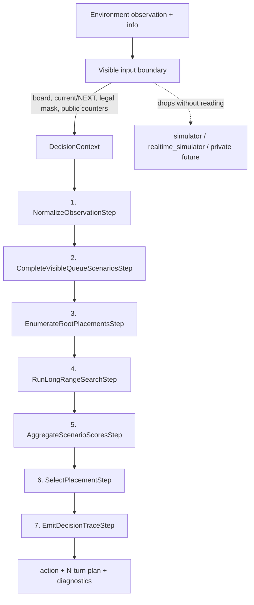

# PUYO-185: deep-chain builder design contract

## Status and scope

This document fixes the public contract for the experimental search-only policy
whose policy ID is `deep_chain_builder`.  Its policy and flow classes are
`DeepChainBuilderPolicy` and `DeepChainBuildFlow`.

PUYO-185 includes:

- the visible-observation boundary;
- externally configured `reference` and `smoke` profiles;
- the generic `DecisionContext`, `DecisionStep`, `StepResult`, `DecisionFlow`,
  and typed decision trace;
- the ordered seven-step builder flow and each step's input/output contract;
- the benchmark gate that later evaluation work must consume without changing
  it after results are known.

PUYO-185 does not implement scenario generation, the evaluator, long-range
search, final plan generation, GUI registration, or the benchmark runner.  The
default deferred steps fail fast until PUYO-186 and PUYO-187 implement them, and
the policy is not added to any product registry in this task.  Existing policy,
GUI, and benchmark behavior therefore remains unchanged.

## Reference and license

The design is based on the public source pinned at commit
[`dea210bcd92965ae08fbc311f23565b0fab6dbbb`](https://github.com/citrus610/ama/tree/dea210bcd92965ae08fbc311f23565b0fab6dbbb).
That source is distributed under the
[`MIT License`](https://github.com/citrus610/ama/blob/dea210bcd92965ae08fbc311f23565b0fab6dbbb/LICENSE),
Copyright (c) 2023 citrus610.

This repository uses the reference as an architectural input.  PUYO-185 does
not copy reference implementation code.  The source name is attribution only:
it must not become a policy ID, Python class, Jira title, configuration profile,
or GUI label.

### Source-to-design mapping

| Pinned source | Observed responsibility | Local design contract |
| --- | --- | --- |
| [`ai/search/beam/beam.h`](https://github.com/citrus610/ama/blob/dea210bcd92965ae08fbc311f23565b0fab6dbbb/ai/search/beam/beam.h) | Search depth, width, trigger, and six-branch constants | `DeepChainBuilderProfile`; values live in `train/config/deep_chain_builder.yaml` |
| [`ai/search/beam/beam.cpp`](https://github.com/citrus610/ama/blob/dea210bcd92965ae08fbc311f23565b0fab6dbbb/ai/search/beam/beam.cpp) | Legal-root expansion, per-layer beam retention, terminal-fire pruning, six future completions, and first-root score aggregation | queue completion, root enumeration, long-range search, and scenario aggregation steps |
| [`ai/search/beam/layer.cpp`](https://github.com/citrus610/ama/blob/dea210bcd92965ae08fbc311f23565b0fab6dbbb/ai/search/beam/layer.cpp) and [`table.cpp`](https://github.com/citrus610/ama/blob/dea210bcd92965ae08fbc311f23565b0fab6dbbb/ai/search/beam/table.cpp) | Width-bounded layers and layer transposition storage | PUYO-186 search-core implementation behind `RunLongRangeSearchStep` |
| [`ai/search/beam/eval.cpp`](https://github.com/citrus610/ama/blob/dea210bcd92965ae08fbc311f23565b0fab6dbbb/ai/search/beam/eval.cpp) | Potential chain, trigger, shape, connectivity, tear, and waste signals | replaceable generic evaluator used by PUYO-186; named-form matching stays out of scope |
| [`ai/ai.cpp`](https://github.com/citrus610/ama/blob/dea210bcd92965ae08fbc311f23565b0fab6dbbb/ai/ai.cpp) | Select the ranked first placement from build-search evidence | `SelectPlacementStep` and the placement-policy adapter |

The local implementation must reuse `agents.compact_search`,
`agents.chain_structure`, and relevant contracts in
`agents.long_horizon_search` where their semantics match.  The flow is an
orchestration boundary, not permission to duplicate those engines.

## End-to-end decision flow



`DeepChainBuilderPolicy.decide()` creates an immutable-context chain.  A step
returns only a `StepResult`; the executor merges its named artifacts and adds a
`DecisionTraceEntry`.  Every completed trace entry contains:

- a stable step ID and implementation type;
- an input summary;
- produced artifact keys;
- candidate count, or `null` when the concept does not apply;
- selection reason, or `null` when no selection occurs;
- elapsed seconds and milliseconds.

The executor validates required inputs and promised outputs at every boundary.
This makes a missing or incorrectly ordered dependency fail at the responsible
step rather than surfacing as an unexplained policy fallback.

## Step contracts

| Order | Step | Required artifacts | Produced artifacts | Responsibility |
| --- | --- | --- | --- | --- |
| 1 | `NormalizeObservationStep` | `visible_runtime_input` | `normalized_observation` | Validate the allowlisted own board, visible current/NEXT pairs, and legal actions. It is the only implemented domain step in PUYO-185. |
| 2 | `CompleteVisibleQueueScenariosStep` | `normalized_observation` | `scenario_sequences` | Preserve every visible pair and complete only the unknown suffix with the configured deterministic representative scenarios. |
| 3 | `EnumerateRootPlacementsStep` | `normalized_observation` | `root_placements` | Enumerate every legal first placement and assign stable root identity. |
| 4 | `RunLongRangeSearchStep` | normalized observation, scenarios, roots | `scenario_search_results` | Apply the configured depth and width per scenario, retaining root identity, score evidence, and representative trajectories. |
| 5 | `AggregateScenarioScoresStep` | scenario search results | `aggregated_root_scores` | Account for every configured scenario exactly once and aggregate by first placement. |
| 6 | `SelectPlacementStep` | aggregated root scores | `selected_action`, `selected_plan`, `selection_evidence` | Choose one legal root using deterministic tie-breaking and retain the reason and N-turn plan. |
| 7 | `EmitDecisionTraceStep` | selected action, selected plan, and evidence | `decision_output` | Expose action, plan, evidence, and trace through policy diagnostics and later replay output. |

The step contracts are defined now so PUYO-186 and PUYO-187 can implement them
without inferring artifact names or flow order.

## Composition and inheritance

`DecisionFlow` supports both extension styles requested for future model work.

Composition returns a validated flow copy:

```python
flow = DeepChainBuildFlow()
flow = flow.replace_step("aggregate_scenario_scores", LearnedAggregateStep())
flow = flow.insert_before("select_placement", CalibrationStep())
```

Inheritance changes the default sequence while retaining the same executor:

```python
class ExperimentalBuildFlow(DeepChainBuildFlow):
    def default_steps(self):
        steps = list(super().default_steps())
        steps[4] = LearnedAggregateStep()
        return tuple(steps)
```

Step IDs must be unique.  Reordering must name exactly the steps currently in
the flow.  Required/provided artifact checks then reject invalid dependency
orders.  A future evaluator or RL selector can therefore replace one step
without inheriting an opaque monolithic policy.

## Observation boundary

The environment `info` currently contains `simulator` and, in realtime mode,
`realtime_simulator`.  Those objects contain authoritative game state and can
lead to the non-public future sequence.  Passing the raw mapping through the
flow would make future leakage possible even if the first implementation did
not intentionally use it.

`build_visible_runtime_input()` therefore performs an allowlist copy.  It does
not enumerate or deep-copy `info`; it reads only:

- legal action mask and its source;
- observation/action schema identifiers;
- own score and public step/tick counters;
- public last-chain counters.

From `observation`, it retains the own board, encoded current/NEXT pairs,
public scalar features, and an optional observation action mask.  Opponent
state is out of this Epic's safe/no-threat scope.  Simulator objects, sequence
generators, and private future queues never enter `DecisionContext`.

The executable boundary fixture is
`tests/fixtures/deep_chain_observation_boundary.json`.  Its test wraps private
keys in a mapping that raises on access, then verifies that normalization
succeeds and that the private sentinel is absent from every context artifact.

## Profiles

Profile values are loaded from `train/config/deep_chain_builder.yaml`; decision
steps must read `context.profile` and must not embed these budgets.

| Parameter | Meaning |
| --- | --- |
| `depth` | Maximum number of pairs explored, including the current pair. |
| `width` | Maximum number of board states retained at each search depth. |
| `scenarios` | Number of deterministic representative completions used only for the unknown part of the queue. |
| `max_expanded_nodes` | Count-authoritative safety bound; elapsed time remains measurement, not a nondeterministic cutoff. |

The `reference` profile is depth 16, width 250, scenarios 6, with a 600,000
expanded-node bound.  It is the canonical quality/benchmark configuration.

The `smoke` profile is depth 4, width 8, scenarios 2, with a 2,048-node bound.
It exists only for fast unit and integration validation and cannot be used as
quality evidence.

## Benchmark contract

The YAML benchmark section is parsed as `DeepChainBenchmarkContract` now so the
later runner cannot silently reinterpret the gate.  PUYO-189 must evaluate the
`reference` profile in `safe_no_threat` conditions with:

- the predeclared contiguous seed range 123 through 152 and 2 deterministic
  repeats per seed (60 runs);
- mean maximum actual fired chain count at least 10;
- zero premature fires and zero game overs;
- zero authoritative simulator parity mismatches;
- zero private-future leaks;
- matching action/plan digests between repeats;
- one-decision p95 at or below 1.0 second.

Prediction-only chain values or evaluator scores do not satisfy the actual-fire
gate.  Quality, determinism, parity, leakage, and latency must remain separate
reported dimensions.  Artifact lineage, fixed seed identities, checksums, and
PASS/FAIL emission are owned by PUYO-189.

## Deferred ownership

- PUYO-186 implements scenario completion, the generic evaluator, root
  enumeration, long-range search, and scenario aggregation.
- PUYO-187 completes selection, policy fallback, decision output, and
  `n-turn-plan-v1` generation. It also makes the selected-plan dependency of
  `EmitDecisionTraceStep` explicit so the typed contract matches its output.
- PUYO-188 registers the policy in `main.py` and connects existing diagnostics
  and N-turn ghost rendering.
- PUYO-189 runs the locked benchmark and records baseline acceptance evidence.

If a later task discovers that the public artifacts above are insufficient, it
must update this document and the contract tests in the same review.  It must
not pass raw simulator/private-future state through an untyped escape hatch.

## Human review checklist

1. Confirm the seven-step order and the required/produced artifact table.
2. Confirm that an evaluator or selector can be replaced independently through
   composition or inheritance.
3. Confirm that the visible boundary contains enough public state while
   excluding simulator and private-future objects.
4. Confirm the external `reference`/`smoke` meanings and budgets.
5. Confirm that the benchmark gate is fixed before PUYO-186 implementation and
   PUYO-189 results.
6. Run `python -m unittest tests.test_deep_chain_builder` and inspect the trace
   fields in `test_policy_adapter_accepts_an_injected_complete_flow`.
