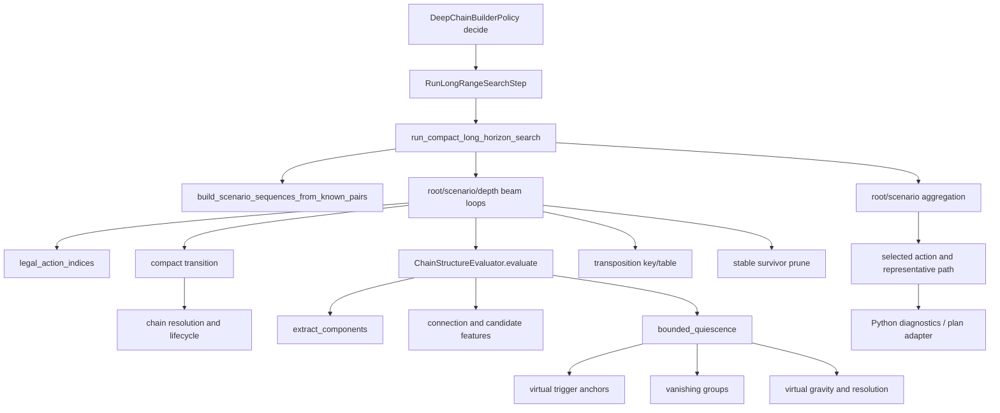

# PUYO-198 Deep-chain native boundary ADR

- Status: Accepted boundary; current native implementation line stopped by
  PUYO-207 **No-Go**
- Date: 2026-08-26
- Final transition decision: 2026-08-27
- Decision owners: PUYO-198 / PUYO-184
- Applies to: PUYO-199 through PUYO-207
- Supersedes: none

## Decision

Use Rust with PyO3 and maturin for the deep-chain native extension.  The FFI
boundary is one call per decision, not one call per search node or kernel.  It
covers scenario completion, compact transition, chain-structure evaluation and
bounded quiescence, candidate generation, beam pruning, the transposition
table, root aggregation, deterministic selection, representative paths, and
bounded diagnostics.

The accepted top-level API is conceptually:

```text
capabilities() -> CapabilityEnvelope
decide(request: bytes) -> bytes
```

`capabilities()` is called once when the extension is loaded and cached by the
Python adapter.  A decision makes exactly one `decide()` call.  No native search
node may invoke Python, create a Python object, serialize JSON, or cross the FFI
boundary.

This is a conditional Go decision for PUYO-199 through PUYO-202.  It is not
approval to change the production default backend.  PUYO-203 may integrate an
explicit native backend only after the component gates in this ADR pass.
PUYO-204 remains the authority for production promotion and the locked
end-to-end gate.

PUYO-207 concluded that conditional path with a final No-Go for the current
native line.  The independent release-wheel run preserved semantic parity and
the mixed transition target, but missed the fixed quiet-transition target.
PUYO-201 therefore remains blocked; no evaluator, search, integration, or
production-promotion task may treat the original conditional Go as current
authorization.

## Locked invariants

This ADR does not change the behavior established by PUYO-186 through PUYO-189:

| Invariant | Locked value |
| --- | --- |
| Reference depth | 16 |
| Reference beam width | 250 |
| Reference scenarios | 6 |
| Reference expanded-node ceiling | 600,000 |
| Budget authority | expanded-node count, never wall time |
| First-decision performance gate | p95 at or below 1.0 second |
| Future information | current/NEXT observable pairs plus deterministic completion only |
| State lifecycle | all 14 rows, OJAMA, all-clear pending, game-over, score, last-chain end score |
| Search semantics | root identity, scenario identity, pair cursor, depth, terminal-fire classification, root quota, stable ranking and tie-break |
| Product behavior in PUYO-198 | unchanged |

The frozen PUYO-189 quality artifact remains canonical.  The PUYO-198 corpus is
differential evidence for implementation work and must not be presented as a
replacement quality baseline.

## Evidence and reproducibility

### Evaluated revision and machine

| Item | Value |
| --- | --- |
| Evaluated commit | `b4528a5d9f4b2b1cfdec641c247da780f7a90232` |
| Config SHA-256 | `bef9b02039b218dd72e6500e74a2c4b6a780b4d55c2c22b7e1a891a35da2dd2d` |
| Corpus digest | `6db18dde8b18c3b71cca701313655ac7f45f87443c7776b0253fa35bcb8fb1b1` |
| CPU | Intel Core Ultra 7 258V, 8 logical CPUs |
| Platform | Linux x86_64, WSL2 kernel 6.6.87.2, glibc 2.39 |
| Interpreter | CPython 3.12.3 |
| Thread environment | OMP/MKL/OpenBLAS/NumExpr/Rayon overrides unset |

Artifact files and every artifact checksum are recorded in
[`benchmark_manifest.json`](../benchmarks/puyo-198-deep-chain-native-profile/benchmark_manifest.json).
The human-readable result is
[`benchmark_report.md`](../benchmarks/puyo-198-deep-chain-native-profile/benchmark_report.md),
and the machine-readable decision is
[`benchmark_summary.json`](../benchmarks/puyo-198-deep-chain-native-profile/benchmark_summary.json).

Reproduce and verify from the repository root:

```bash
.venv/bin/python -m eval.deep_chain_native_profile verify-corpus
.venv/bin/python -m eval.deep_chain_native_profile all \
  --reference-timeout 10 \
  --sample-interval 0.01
.venv/bin/python -m eval.deep_chain_native_profile verify
```

`all` intentionally replaces the PUYO-198 artifact directory.  The manifest
binds the output to the evaluated Git commit, config checksum, corpus digest,
raw profiles, summary, and report.  `verify` rejects checksum, schema, ticket,
commit, or digest drift.

### Frozen corpus

[`corpus.json`](../benchmarks/puyo-198-deep-chain-native-profile/corpus.json)
freezes seed 123 and contains:

- `empty_quiet`, `two_chain`, and `hidden_rows_preserved` state/pair/action
  cases, with transition and evaluator payloads and digests;
- the exact six-plane, bottom-to-top state bytes, including hidden rows and
  lifecycle flags;
- a seed-123 mini search with the known three pairs, profile parameters,
  selected action, ranked roots, counters, result digest, and deterministic
  search digest;
- source-fixture and configuration checksums.

The checked-in source corpus is
[`eval/deep_chain_native_corpus.json`](../../eval/deep_chain_native_corpus.json).
`freeze-corpus` is an explicit maintenance command; normal profiling verifies
rather than silently refreshing it.

### Measurement method and limits

The completed smoke and intermediate decisions run in isolated spawned
processes.  Each records `cProfile` deterministic call data, a separate stack
sampler, wall/process/user/system time, peak RSS, search counters, selected
action, result digest, system metadata, warmup/iteration counts, and source
provenance.  Sampler implementation frames are excluded from workload-share
calculations.

`cProfile` changes absolute latency.  Its wall values establish call topology
and relative cost, not the uninstrumented p95 gate.  Inclusive times overlap by
definition; exclusive group shares do not.  Peak RSS is process-level
allocation evidence, not per-function allocator attribution.  Native tasks
must add arena/table capacity and allocator high-water telemetry.

The exact reference decision is sampled under a 10-second supervisor and does
not complete.  This is a lower-bound probe, not canonical quality evidence.
The 300-second lower bound used in the Amdahl calculation comes from the
accepted PUYO-189 reference evidence.  PUYO-189's single sampled stack is only
supporting prior evidence and is never converted into a percentage.

## Current call graph



The native boundary starts before `build_scenario_sequences_from_known_pairs`
and ends after root aggregation and representative-path selection.  The Python
adapter owns only allowlisted input extraction, envelope encoding/decoding,
schema conversion, provenance reporting, and fallback selection.

## Profile results

### Workloads

| Workload | Configuration | Result | Profile wall | Expanded/evaluated | Peak RSS |
| --- | --- | --- | ---: | ---: | ---: |
| Smoke | depth 4, width 8, scenarios 2, max 2,048 | completed, action 6 | 21.364 s | 1,100 / 1,100 | 44,180 KiB |
| Intermediate | depth 5, width 12, scenarios 3, max 8,192 | completed, action 9 | 68.945 s | 3,234 / 3,234 | 52,996 KiB |
| Reference | depth 16, width 250, scenarios 6, max 600,000 | timed out under supervisor | at least 10.000 s | partial sampling only | child-owned |

The reference sampler collected 654 workload samples.  Of these, 92.51% were
in bounded quiescence, 2.60% in digest work, 1.99% in component extraction, and
1.99% in compact transition.  The intermediate sampler independently placed
93.93% of its 4,463 workload samples in bounded quiescence.

### Exclusive hotspot groups

The intermediate deterministic profile is the percentage authority:

| Group | Calls | Exclusive time | Share | Exclusive cost / expanded node |
| --- | ---: | ---: | ---: | ---: |
| bounded quiescence | 232,123,591 | 62.798 s | 92.321% | 19,418.098 us |
| search control | 78,219 | 1.781 s | 2.618% | 550.698 us |
| component extraction | 946,945 | 1.061 s | 1.560% | 328.076 us |
| compact transition | 1,722,270 | 0.838 s | 1.232% | 259.211 us |
| aggregation/serialization | 844,917 | 0.682 s | 1.003% | 210.934 us |
| digest | 513,154 | 0.515 s | 0.758% | 159.332 us |
| evaluator orchestration | 9,705 | 0.202 s | 0.297% | 62.457 us |
| decision orchestration | 233,223 | 0.086 s | 0.127% | 26.628 us |
| evaluator scalar score | 3,235 | 0.021 s | 0.031% | 6.624 us |
| candidates, beam, TT, scenario aggregate/diagnostics | 10,117 | 0.029 s | 0.043% | 8.854 us |

The very large call count is itself evidence against fine-grained bindings.
Crossing the FFI boundary for transition or evaluator calls would preserve the
Python beam loop and multiply conversion overhead by thousands of nodes.

### Inclusive and exclusive functions

Representative source functions from the same raw profile are:

| Function | Calls | Inclusive time | Exclusive time | Exclusive / expanded node |
| --- | ---: | ---: | ---: | ---: |
| `bounded_quiescence` | 3,235 | 36.527 s | 1.751 s | 541.566 us |
| `_virtual_trigger_anchors` | 1,577,931 | 25.722 s | 13.539 s | 4,186.562 us |
| `_resolve_virtual` | 58,664 | 19.345 s | 0.992 s | 306.764 us |
| `_vanishing_groups` | 117,892 | 12.601 s | 7.838 s | 2,423.603 us |
| `_cell_bit` | 116,055,131 | 8.499 s | 8.499 s | 2,627.862 us |
| `_components_from_planes` | 58,664 | 6.285 s | 3.952 s | 1,221.912 us |
| `_apply_gravity` | 59,228 | 3.515 s | 3.146 s | 972.677 us |

Built-in list/set/sort costs are attributed to their workload caller in the
group table.  Full function rows, primitive/total call distinctions, and both
per-call and per-node values remain in
[`raw/intermediate_profile.json`](../benchmarks/puyo-198-deep-chain-native-profile/raw/intermediate_profile.json).

### Microbenchmarks

| Operation | Iterations | Mean wall | Throughput | Scope |
| --- | ---: | ---: | ---: | --- |
| compact transition | 500 | 137.479 us | 7,273.9 ops/s | one state/pair/action |
| evaluator | 12 | 2,412.458 us | 414.5 ops/s | one evaluated compact state |
| serialization | 1,000 | 338.287 us | 2,956.1 ops/s | diagnostic JSON-like payload upper reference |
| TT key | 500 | 0.918 us | 1,089,664.1 ops/s | one complete Python key |
| mini search | 1 | 2.418 s | 0.414 ops/s | depth 3, width 4, scenarios 2 |

The serialization microbenchmark does not prescribe JSON for the FFI.  It
shows that one decision-level conversion can fit the fixed serialization
budget while per-node conversion cannot.

## Amdahl feasibility

The one-call boundary contains 99.8626728% of measured exclusive work.  With a
300-second reference lower bound and a 1.0-second gate:

```text
required end-to-end speedup >= 300.0x
maximum speedup if boundary work were free = 728.188x
required boundary speedup = 509.487x
```

Therefore the selected boundary leaves enough mathematical headroom, but the
required native speedup is severe and not yet demonstrated.  A smaller
transition-only or evaluator-only boundary is a No-Go because its residual
Python loop cannot reach the gate.  If the complete one-call implementation
misses its native p95 budget, PUYO-203 must not hide the miss with fallback or
policy-level timing.  The task owning the miss must attach an internal native
profile and return the design to ADR review.

## Performance budgets

Reserve 100 ms of the 1-second gate for integration jitter and non-native
Python work.  Of the remaining 900 ms, reserve fixed decision-level floors for
serialization and aggregation, then distribute the balance using measured
exclusive shares:

| Category | Decision p95 budget | Canonical budget at 600,000 expanded nodes |
| --- | ---: | ---: |
| transition | 10.596 ms | 0.017660 us/node |
| evaluator and quiescence | 810.029 ms | 1.350048 us/node |
| search, beam, TT, candidate control | 29.375 ms | 0.048958 us/node |
| request/response serialization | 20.000 ms | per decision |
| root aggregation and result materialization | 30.000 ms | per decision |
| native call total | 900.000 ms | per decision |
| adapter/integration safety margin | 100.000 ms | per decision |
| end-to-end total | 1,000.000 ms | per decision |

The transition and evaluator rows above preserve the original PUYO-198
allocation and its provenance.  After PUYO-200 missed the isolated transition
share, [the PUYO-205 ADR delta](puyo-205-native-transition-adr-delta.md)
replaced those two rows as separate downstream pass authorities with their
unchanged 820.625 ms sum.  PUYO-206 met the fixed mixed/quiet transition
targets of 100.0/50.0 ns as a component result.  PUYO-207 independently
remeasured the same implementation and missed the quiet target, so the
combined residual is diagnostic only.  The 900 ms native and 1,000 ms
end-to-end gates remain unchanged but were not reached.

Rules for all downstream measurements:

1. Use a release wheel and record cold/warm p50/p95, machine, thread count,
   SIMD path, wheel hash, request/result sizes, peak RSS, node count, and step
   timings.
2. Do not remove outliers, replace count-authoritative limits with timeouts, or
   reduce the locked profile.
3. A component task passes only with zero differential mismatches on its frozen
   corpus and its own budget met.  A faster non-equivalent implementation does
   not pass.
4. PUYO-204 passes only when end-to-end p95 is at most 1.0 second, deterministic
   digest mismatch count is zero, Python/native parity mismatch count is zero,
   and private-future leak count is zero.

### PUYO-207 final re-evaluation

The independently rebuilt release artifact passed all semantic,
deterministic, allocation, ABI, and memory checks.  Its locked mixed p95 was
77.119 ns against the 100.0 ns target, while quiet p95 was 57.325 ns against
the 50.0 ns stop condition.  No samples were removed and the frozen sample,
warm-up, affinity, percentile, and corpus contract was unchanged.

At 600,000 evaluated nodes, the mixed result projects to 46.272 ms and would
leave 774.353 ms for evaluator/quiescence inside the 820.625 ms envelope.
Because the quiet component target failed first, this arithmetic does not
grant PUYO-201 a budget or authorize implementation.  The source-bound result
is [the PUYO-207 independent verification](puyo-207-native-transition-verification.md).

## Language and binding evaluation

| Candidate | Performance and boundary | Determinism/safety | Build and maintenance | Decision |
| --- | --- | --- | --- | --- |
| Rust + PyO3 + maturin | Native loops, compact value types, one `bytes` call, explicit GIL detach | Checked arithmetic, ownership, no GC in hot loop, strong data-race controls | Repository architecture already designates Rust for measured bottlenecks; Cargo lock and maturin wheel flow are reproducible | Selected |
| C++20 + nanobind | Comparable native ceiling and low-overhead bindings; GIL release supported | Manual lifetime/aliasing/UB discipline; deterministic containers require project wrappers | Good compact binding option, but adds CMake and a separate C++ dependency/tooling surface | Runner-up |
| C++20 + pybind11 | Mature and broadly understood; one-call design is viable | Same C++ memory risks; Python-facing convenience can invite object-rich boundaries | Larger/general binding surface than needed and normally interpreter-version-specific | Rejected |
| JAX | Strong for static array kernels | Branch-heavy variable beams, set/dict TT, bounded recursive search, and dynamic paths require a semantic rewrite | JIT warmup and accelerator/runtime dependencies do not match a sub-second deterministic CPU decision | Rejected |

JAX is not an alternate implementation for this contract.  JAX documentation
requires staged control flow and explains that Python control flow under `jit`
is resolved at trace time; the current input-dependent search and dynamic
candidate topology are not an array-kernel port.

The local environment has `g++ 13.3.0` but no CMake, Rust compiler, or Cargo.
That does not favor C++: PUYO-199 must install the pinned Rust toolchain before
scaffolding and record the toolchain/cache setup in CI.  Failure to build the
pinned release wheel on Linux x86_64 blocks PUYO-200 and is a No-Go for this
language choice until the ADR is revised.

## Selected toolchain

| Component | Pinned decision |
| --- | --- |
| Rust | 1.98.0, edition 2024, `rust-toolchain.toml`, minimal profile plus `rustfmt` and `clippy` |
| PyO3 | exact crate version `=0.29.0`, extension-module feature |
| maturin | exact Python build dependency `==1.14.1` |
| Python ABI | CPython 3.12 version-specific `cp312`; no `abi3` for the first performance baseline |
| Supported release target | Linux x86_64, `manylinux_2_28_x86_64` wheel |
| Cargo dependencies | exact direct versions and committed `Cargo.lock` |
| Release profile | `opt-level=3`, fat LTO, one codegen unit, incremental off, overflow checks on, unwind panic strategy, line tables retained |
| CPU policy | portable x86-64 release baseline; never `target-cpu=native` in a distributed wheel |

The CPython-specific wheel deliberately avoids stable-ABI performance and API
tradeoffs during the first gate.  Supporting another Python minor, OS,
architecture, `abi3`, free-threaded CPython, or a CPU-specific SIMD wheel needs
an explicit compatibility/performance task.  Runtime SIMD dispatch is allowed
only when a scalar implementation remains available, both paths are
differentially identical, and the selected path is returned in provenance.

Native computation runs outside the GIL using PyO3's interpreter detach API.
The adapter must validate and copy/borrow the complete request before detach,
perform no Python API calls while detached, and reacquire only to allocate the
single response `bytes` or raise the mapped exception.

## Binary envelope contract

### Common framing

The wire name is `puyo.deep_chain_native.envelope.v1`.  Integers use little
endian.  The fixed 32-byte header is:

| Offset | Type | Field | Rule |
| ---: | --- | --- | --- |
| 0 | `u8[4]` | magic | ASCII `PDCN` |
| 4 | `u16` | schema major | `1` |
| 6 | `u16` | schema minor | initially `0` |
| 8 | `u8` | kind | 1 request, 2 success, 3 error, 4 capabilities |
| 9 | `u8` | byte order | 1 means little endian |
| 10 | `u16` | flags | unknown bits rejected |
| 12 | `u32` | header bytes | exactly 32 for v1 |
| 16 | `u32` | body bytes | excludes header |
| 20 | `u16` | section count | bounded before allocation |
| 22 | `u16` | reserved | zero |
| 24 | `u64` | request id | echoed unchanged |

The body is a sequence of 8-byte-aligned TLV sections.  Each section starts
with `tag: u16`, `version: u16`, and `length: u32`; padding bytes must be zero.
The high bit of a tag marks a required section.  Unknown optional sections are
skipped, unknown required sections are rejected.  Duplicate singleton tags,
integer overflow, trailing data, non-zero padding, or a length beyond the
configured maximum is an invalid-input error.

`capabilities()` reports the envelope major/minor range, request/result schema
digests, feature versions, supported Python ABI, target, thread modes, and
maximum sizes.  Major versions must match exactly.  A native minor must be at
least the adapter's requested minor.  Missing required sections never receive
a default.  Response headers echo the negotiated version and request ID.

### Request sections

| Section | Required content |
| --- | --- |
| root state | Exactly `CompactSearchState.to_bytes()`: `CSK1`, six 11-byte planes in RED/BLUE/GREEN/YELLOW/PURPLE/OJAMA order, flags, `u64 score`, `u64 last_chain_end_score` |
| known pairs | `u16 pair_count`, then two color IDs per observed pair; no authoritative/private queue field exists |
| search config | depth, width, scenarios, minimum chain, max expanded nodes, seed option/value, sampling mode, terminal-fire rule/count, root quota, fire context, penalty, winning threshold option/value, TT flag |
| evaluator config | feature/schema/weight version strings, four bounded-quiescence budgets, 24 ordered `f64` weights, finite fatal score |
| schema identities | action layout, compact-state, scenario sampling, ranking, terminal score, diagnostics, and result schema versions plus full config digest |
| execution | deterministic mode `oracle-1` or `scenario-6`, response detail flags, maximum response bytes |

For the state, bit `y * 6 + x` identifies a cell; `y=0` is the bottom row and
all 14 rows participate.  The two flag bits are all-clear-bonus-pending and
game-over.  Planes may not overlap and bits 84 or above must be zero.  Scores
must satisfy `last_chain_end_score <= score`.  Column heights are derived and
must not be duplicated in the input.

Color IDs are contract-local and never depend on Python Enum ordinals:

| ID | Color |
| ---: | --- |
| 1 | RED |
| 2 | BLUE |
| 3 | GREEN |
| 4 | YELLOW |
| 5 | PURPLE |
| 6 | OJAMA, state planes only |

Pairs accept only IDs 1 through 5.  The Python adapter passes only observable
known pairs.  Native scenario completion consumes the seed and versioned
sampling mode.  There is no pointer, callback, object handle, optional section,
or reserved tag through which the simulator's private future queue can pass.

The action layout is `puyo.placement_actions.v1`:

| Axis x | Action IDs in Direction order |
| ---: | --- |
| 0 | 0 UP, 1 RIGHT, 2 DOWN |
| 1 | 3 UP, 4 RIGHT, 5 DOWN, 6 LEFT |
| 2 | 7 UP, 8 RIGHT, 9 DOWN, 10 LEFT |
| 3 | 11 UP, 12 RIGHT, 13 DOWN, 14 LEFT |
| 4 | 15 UP, 16 RIGHT, 17 DOWN, 18 LEFT |
| 5 | 19 UP, 20 DOWN, 21 LEFT |

The evaluator weight order is exactly the declaration order of
`ChainStructureWeights`: `potential_chain_count`, `potential_chain_score`,
`required_key_count`, `trigger_height`, `trigger_protection`,
`remaining_link_2`, `remaining_link_3`, `connectivity_edge`,
`connection_candidate`, `reachable_ignition`, `growth_site`,
`foundation_cell`, `fold_space`, `adjacent_roughness`, `height_spread`,
`well_depth`, `bump_height`, `danger_ratio`, `nuisance_puyo`,
`hidden_row_puyo`, `tear`, `waste`, `trigger_damage`, and `premature_fire`.
Count and schema digest must match before values are read.

### Native state and transposition layout

The Rust state is six 128-bit-aligned bit planes whose upper 44 bits remain
zero, two lifecycle flags, and two checked `u64` scores.  The wire remains the
existing 11-byte-per-plane canonical form; alignment is an internal detail and
must not leak into serialized bytes.

The complete TT identity is:

```text
(six planes, all-clear flag, game-over flag, score, last-chain-end score,
 root_action: u8, scenario_id: u8, pair_cursor: u16, depth: u16)
```

Hash matches must compare the complete key or a verification fingerprint plus
complete state; collision never implies equality.  Floats, evaluator results,
paths, and process-random hash seeds are excluded.  Capacity/replacement
changes need a versioned ablation and differential proof.

All counters and scores use checked integer arithmetic.  Overflow returns a
typed error and never wraps.  Input weights/config floats must be finite.  The
native scorer uses IEEE-754 `f64`, fixed operation order, no fast-math, and the
existing stable ranking/tie-break sequence.  NaN is forbidden.  Existing
unavailable `-Infinity` values are represented internally by an availability
enum and reconstructed by the Python result adapter only where the legacy
schema requires it.

### Success sections

A success envelope contains enough information to reconstruct the current
`LongHorizonSearchResult` and `DeepChainDecision` losslessly:

| Section | Content |
| --- | --- |
| decision | selected action, ranked root action IDs, search-complete/budget status, deterministic result digest |
| counters | expanded/generated/evaluated/invalid/pruned/terminal/game-over nodes, TT hits, reached depth, per-step timings |
| root evidence | every root/scenario value, fire class, ranking tuple/breakdown, support/coverage, terminal evidence |
| representatives | action ID paths, scenario/pair cursors, compact predicted states needed by the plan and GUI |
| diagnostics | bounded root build diagnostics and survivor coverage, never per-node traces |
| provenance | backend/version, crate and schema versions, Git SHA, rustc, build profile, target, wheel hash hook, thread mode/count, SIMD path |

Variable records carry explicit counts and are bounded by request limits before
allocation.  Root/scenario output is sorted by stable IDs, never hash-table or
worker completion order.  The adapter computes the existing Python canonical
digest from the reconstructed schema and compares it in differential tests.

### Errors and fallback

Error envelopes contain a stable code, failing section/tag, bounded UTF-8
message, backend provenance, and whether retry is safe.  Codes are:

| Code | Meaning | Adapter action |
| --- | --- | --- |
| `INCOMPATIBLE_SCHEMA` | major/minor/schema identity mismatch | disable native instance; explicit native mode raises |
| `INVALID_INPUT` | malformed state, pair, config, float, size, or checksum | raise; never fallback silently |
| `UNSUPPORTED_CONFIG` | valid but unimplemented version/mode | explicit native raises; auto may fallback with diagnostics |
| `RESOURCE_EXHAUSTED` | bounded arena/table/result capacity exceeded | raise in QA; auto fallback only in product integration |
| `INTERNAL_PANIC` | panic caught at the Rust entrypoint | quarantine instance and raise/fallback according to mode |
| `BACKEND_UNAVAILABLE` | import/build/CPU feature failure | Python backend remains available |

No Rust panic or exception may unwind across the FFI boundary.  No partially
filled success response is accepted.  The Python adapter validates the entire
success envelope before exposing it.

Backend policy is fixed as follows:

- `python`: existing implementation only;
- `native`: any native error raises and is visible to tests/operators;
- `auto`: availability, compatible-schema, unsupported-config, resource, or
  internal errors may make one deterministic Python retry and must record the
  cause plus attempted native provenance;
- parity/digest/future-isolation failures always fail closed and may never be
  hidden by `auto` fallback.

PUYO-198 adds no backend selector and leaves the production path on Python.

## GIL and deterministic parallel policy

PUYO-199 through PUYO-201 implement and validate `oracle-1` first.  It detaches
from the GIL but uses one native worker so its ordering is the differential
oracle.  PUYO-202 adds `scenario-6`, using a reusable native pool of at most six
workers.  Nested Rayon/global-pool behavior is forbidden; thread count comes
only from the versioned execution section and is returned in provenance.

The current Python budget is global and scenarios execute in canonical order.
To preserve this under six-way execution:

1. Workers may speculatively evaluate independent scenarios, each with bounded
   arenas and cancellation checks.
2. The coordinator commits results only in canonical scenario ID order and
   accumulates expanded-node counts in that order.
3. If a scenario crosses the remaining global budget, its speculative result
   and all later results are discarded; that scenario is rerun with exactly the
   remaining count-authoritative budget in oracle order.
4. Aggregation consumes committed `(scenario_id, root_action)` records in stable
   order.  Worker completion order is never observable.

`oracle-1` and `scenario-6` must produce identical selected action, ranked
roots, representative paths, evidence, counters, truncation status, and digest
for every differential case, including deliberately exhausted small budgets.
If deterministic six-scenario execution cannot meet this contract, only
`oracle-1` may proceed to PUYO-203 and the performance decision returns to ADR
review.  Parallelism never justifies changing search semantics.

## Downstream gates

| Ticket | Required handoff and stop condition |
| --- | --- |
| PUYO-199 | Scaffold pinned wheel/build, implement capability/envelope codec and one-call Python adapter, GIL detach/error tests; stop if release wheel cannot build on Linux x86_64 |
| PUYO-200 | Port compact transition with all 14 rows/lifecycle and frozen transition parity; owns the unresolved transition performance gate after PUYO-207 No-Go |
| PUYO-205 | Profile transition stages and alternatives, confirm the call model, and fix the successor measurement and budget contract |
| PUYO-206 | Implement the selected three-slice local-update/hot-result redesign; component measurement met mixed p95 <= 100.0 ns and quiet p95 <= 50.0 ns |
| PUYO-207 | Final No-Go: independent mixed p95 77.119 ns passed, quiet p95 57.325 ns failed; PUYO-201 was not unblocked |
| PUYO-201 | Blocked; do not port evaluator/quiescence unless a new ADR and transition gate authorize a successor line |
| PUYO-202 | Port the complete beam/TT/aggregation loop, oracle and deterministic six-worker modes; meet 29.375 ms search plus 30 ms aggregation |
| PUYO-203 | Integrate one call per decision and explicit backend/provenance/fallback; do not make native the default or mask a missed native budget |
| PUYO-204 | Run locked 30-seed quality/performance/future-isolation evidence; promote only at p95 <= 1.0 s with zero parity/digest/leak failures |

## Consequences

Positive consequences:

- The boundary encloses the measured bottleneck and leaves a small Python share.
- One canonical binary request makes future leakage and schema drift auditable.
- Rust ownership and checked arithmetic reduce memory/collision failure risks in
  the largest allocation and concurrency changes.
- The single-thread oracle isolates semantic parity before optimization and
  scenario parallelism.

Costs and risks:

- A 509.487x native-boundary speedup is required by the current lower bound;
  language choice alone will not achieve it.
- The project gains a pinned Rust/wheel toolchain not installed on the measured
  workstation today.
- A manual versioned codec and lossless result adapter require dedicated
  compatibility tests and golden bytes.
- Exact global-budget behavior makes deterministic scenario parallelism more
  complex and may reduce its benefit when the budget is exhausted.

## References

- [PUYO-198](https://shhchan.atlassian.net/browse/PUYO-198)
- [PUYO-189 baseline](puyo-189-deep-chain-builder-baseline.md)
- [Deep-chain design and Ama attribution](puyo-185-deep-chain-builder-design.md)
- [Repository RL architecture](puyo-rl-architecture.md)
- [`agents/deep_chain_builder.py`](../../agents/deep_chain_builder.py)
- [`agents/long_horizon_search.py`](../../agents/long_horizon_search.py)
- [`agents/chain_structure.py`](../../agents/chain_structure.py)
- [`agents/compact_search.py`](../../agents/compact_search.py)
- [Rust 1.98.0 release](https://blog.rust-lang.org/releases/1.98.0/)
- [rustup toolchain override files](https://rust-lang.github.io/rustup/overrides.html)
- [PyO3 0.29.0 release](https://github.com/PyO3/pyo3/releases/tag/v0.29.0)
- [PyO3 build and distribution](https://pyo3.rs/main/building-and-distribution.html)
- [PyO3 interpreter detach and free-threading guidance](https://pyo3.rs/main/free-threading)
- [maturin tutorial](https://www.maturin.rs/tutorial.html)
- [maturin configuration](https://www.maturin.rs/config)
- [maturin distribution](https://www.maturin.rs/distribution.html)
- [nanobind rationale](https://nanobind.readthedocs.io/en/latest/why.html)
- [nanobind build system](https://nanobind.readthedocs.io/en/latest/building.html)
- [pybind11 documentation](https://pybind11.readthedocs.io/)
- [JAX control-flow constraints](https://docs.jax.dev/en/latest/control-flow.html)
- [Ama pinned source and MIT license](https://github.com/citrus610/ama/tree/dea210bcd92965ae08fbc311f23565b0fab6dbbb)
