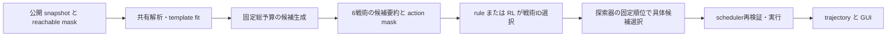

# PUYO-234 次世代モデル設計メモ

> Status: 実装計画を伴う設計 v1（2026-09-23）。1〜10節はヒアリング合意、11節以降はその具体化。新しい数値・学習予算は実験初期値であり、実測の合格や長時間学習の承認を意味しない。

## 1. 目的

`deep_chain_builder` の高速な大連鎖候補生成を維持したまま、局面に応じて戦術を選び直し、対戦の勝利へ向かうモデルを作る。

- 探索器は具体的な合法手・候補列・期限付き発火候補を生成する。
- RL は有限個の戦術 ID から、実行可能な戦術を選ぶ。
- RL に具体的な配置、目標スコア、許容手数、リスク許容度を直接出させない。
- 小連鎖を常用するのではなく、明確な勝利機会だけで高精度な短期攻撃を選べることを目指す。

## 2. 責務分担

| 担当 | 責務 |
|---|---|
| テンプレート探索器 | 開始時・対応後・本線発火後に、定型へのフィットを評価し、選択可能なら定型を選ぶ。 |
| `deep_chain_builder` | 選択戦術と局面から、具体手、候補、必要火力、期限、根拠を生成する。 |
| RL 戦術選択器 | 局面要約と action mask から戦術を選び、継続・切替を学習する。 |
| GUI / trajectory logger | 人間用の思考過程と、RL が実際に受け取ったデータを別々に記録する。 |

開始時の定型選択は RL の責務ではない。RL は、選ばれた定型を使う `定型土台構築` を継続するか、相殺・カウンター等へ切り替えるかを選ぶ。

## 3. 戦術集合

| 戦術 | 意図 |
|---|---|
| 大連鎖構築 | 安全性を保ちながら本線を成長させる。 |
| 定型土台構築 | 選択済みの定型を優先して組む。 |
| 発火準備・発火 | 安全に飽和した本線を発火する。 |
| 相殺準備・相殺 | 相手のおじゃまが降る前に、それ以上の火力を発火して相殺する。 |
| カウンター | 高い発火点を残し、最初のおじゃま落下後の一手で発火する。 |
| 決定的な短期攻撃 | 相手の明確な隙を突く勝利級の小連鎖・2 ダブ等。 |

`防御` は独立戦術にしない。相手本線・副砲への積極的な対応は相殺・カウンターで表す。相殺もカウンターも不可能な攻撃は、専用の敗戦回避戦術を増やさず、既存戦術の評価の中で扱う。

## 4. テンプレート

### 4.1 初期候補と設定

- 初期候補は GTR、だぁ積み、ペルシャ式。
- config は有効テンプレート群、構造条件、variant、選択方式、将来の個別 `commit_turns` を表す。
- 新しい定型は原則コード変更なしで config の追加・変更により試せる。
- 初期実装では GUI は既存 config の候補・各パラメータを編集する。pattern 自体の作成・編集は config ファイルで行う。

pattern は `A`、`B`、`C`、`D` … を使う。同じ記号は同色である。異なる記号が必ず異色とはせず、必要な色関係だけを制約として明記する。`.` / `*` は盤面状態を問わない判定対象外のマスとして扱う。pattern は常にフィールド底面を基準に照合する。標準形、色順別形、底上げ形などは一つの定型の variant 群とする。

### 4.2 選択

探索器は初手と既知ツモから、各テンプレートの必須構造へ近づける適合スコアを算出する。初期のスコアは「指定定型を組みやすいか」だけを測り、連鎖の強さ・勝率・長期優位は混ぜない。

初期の「フィットして組めそう」の判定は、少なくとも一つの variant について、現在盤面と既知ツモから必須の色関係を壊さずに前進できる合法配置があることとする。variant schema の詳細な表現力、スコアの閾値、長期的な採用価値は後続改良で調整する。

| mode | 選択 |
|---|---|
| `argmax` | 最高スコアを確率 1 で選ぶ。評価・再現・通常デモの既定。 |
| `softmax` | 高スコアほど選ばれやすくする。温度で多様性を調整し、探索的比較・データ収集で使う。 |

確率選択の seed と config digest は必ず残す。

テンプレート有効モードの対局開始時は、候補群から必ず一つを選ぶ。全候補が低適合でも、相対的に最良のものを選ぶ。テンプレート無効モードは最初から自由構築を行う。

### 4.3 定型フェーズと遷移

- 選択した定型は、最大 `N=14` 回の自分の decision で優先して構築する。初期は全定型共通とし、個別設定へ拡張できる形にする。
- `N` を超えると自由形の大連鎖構築へ移る。
- 脅威や明確な勝機は定型中でも別戦術への即時切替理由になる。ただし軽微な短期利益では定型を離れず、大連鎖へつながる構築を優先する。
- 相殺・カウンター後は、以前の定型へ単純に戻らない。現在盤面を再評価し、フィットする定型があれば改めて選び、新しい `N=14` 手の定型フェーズを始める。どの定型もフィットしなければ自由構築へ移る。
- 本線発火後も同じ二段階判定を行う。フィットする定型があれば再選択、なければ自由構築で再構築する。

## 5. 本線、相殺、カウンター

本線は、ゲームオーバーを避け、発火スコアを可能な限り高めた安全な「飽和」を目指す。同スコアなら、上部の安定性と、発火後に有効テンプレートのいずれかを再構築しやすい地形を軽量に比較する。残し評価のために長期探索を追加せず、variant との静的な盤面整合性など安価な特徴だけを使う。

相手脅威には、予測スコア、連鎖数、連鎖終了までの時間を用いる。初期版では、相手スコア以上を期限内に発火できる候補があれば対応可能とする。完全な相殺・着地タイミングの対戦シミュレーションは後続拡張である。

カウンターでは、総おじゃま量を 5 段以下に制限しない。一度に落ちるおじゃまが最大 5 段であり、その後に一手操作できることを利用する。探索器は、最初の落下後に発火点が残ること、その一手で発火できること、火力が十分であることを評価する。

## 6. RL の観測、行動、報酬

RL には盤面の生表現や生の match tick を大量に渡さず、解析器・探索器の要約を渡す。

時間系特徴は以下に絞る。

| 特徴 | 意味 |
|---|---|
| 脅威までの余裕 | `なし` / `潜在` / `逼迫` / `即時`。`逼迫` だけで定型放棄を強制しない。 |
| 必要火力への対応見込み | 期限内対応候補が `可能` / `際どい` / `不可能`。定型継続可否の判断材料であり、単独の強制切替ではない。 |
| 先打ちの時間損失 | 発火が相手に実質的な構築猶予を与えるか。 |

追加の要約には、自他本線・副砲・安全性、定型フェーズ残り手数・フィット状況、戦術別候補の有無・品質を含める。生の tick は環境・探索・評価器だけが保持する。

action mask は探索器が生成する。構造的に不可能な戦術は選べない。一方、短期攻撃は「候補がある」なら選択可能とし、それが本当に勝利級かは RL に勝敗から学ばせる。

報酬は勝敗を主とする。補助的に、脅威への対応可能性、安全な大連鎖成長、期限内発火を扱う。小連鎖や短期スコアそのものに強い正報酬を与えない。定型フェーズ中は定型継続を強く初期選好にするが、勝利級の好機・脅威対応の余地は残す。

## 7. 公平性とタイミング

標準・公平モードは、自他盤面、公開 current / NEXT / NEXT2、おじゃま・発火状態など、対局画面から観測できる情報だけを使う。未公開未来、実行時 seed、oracle 情報は禁止する。

将来の最強モードでは、有限個の配色パターンと公開済みツモ履歴から一意に復元できた未公開ツモを使うことを許容する。このとき、復元根拠となった公開履歴を必ず記録し、隠れ情報漏洩と区別する。

連鎖モーション中に相手が構築を進める時間を、環境・探索・評価で一貫して反映する。これにより、軽微な優位のための 3〜4 連鎖先打ちを RL が過大評価しないようにする。

## 8. 学習と評価

1. ルールベース戦術選択を、合意済みの優先順で実装する。
2. decision ごとの観測、mask、探索根拠、選択戦術、結果を教師軌跡として収集する。
3. 軌跡から bootstrap し、自己対戦 RL へ進む。
4. opponent curriculum は弱い相手、ルールベース、過去 checkpoint、多様な戦術を持つ相手へ段階的に進める。

採用ゲートは、同一探索・対戦条件のルールベース比勝率だけでなく、定型の不自然な中断、即時・逼迫脅威への対応、小連鎖先打ち率、発火後の生存率を比較する。

初期テンプレート機能の受け入れ条件は、脅威のない固定盤面・固定ツモで、探索器が選んだ定型の variant の一つを最大 14 手以内に成立させることである。

## 9. GUI、ログ、lineage

GUI は対局中に現在戦術、選択中の定型または自由構築、切替理由、遷移履歴をリアルタイム表示・保存する。テンプレート適合スコアや選択確率は GUI には表示しないが、実験・RL 用ログには残す。

RL 用 trajectory には、実際に渡した派生観測、action mask、選択戦術、選択定型、探索候補・根拠、報酬、最終勝敗、config / schema / checkpoint / seed / 探索予算 / timing contract を保存する。

既存 lineage registry を拡張し、ルールベース、テンプレート追加、bootstrap、RL run、curriculum 変更、評価・採否をノード・エッジとして結ぶ。プレゼン向け主グラフには意味のある採用・不採用ノードを両方出し、採用経路をハイライトする。定期 checkpoint は折り畳み可能な詳細に留める。

## 10. 実行プロファイル

体感上、現行 `deep_chain_builder` より明確に遅くしないことを目標にする。ただし初期版ではハードな固定制約にせず、遅延時は深さ・幅・scenario 数を調整する。`fast` / `standard` / `deep` のような固定探索プロファイルを config から選び、実行中の自動調整は行わない。各 run でプロファイル、マシン情報、p50/p95 を記録する。

## 11. 現行実装との差分と採用する境界

確認元は未マージの [PR #135](https://github.com/shhchan/puyo-ai-dev-platform/pull/135)、その初期 head `ba01fc54d52bd64a2b96e74572903e294be889e8`、起点 `integration/puyo-113-v1-7-2` の `ed6fbbbe252e628bf8a9cb4a67e9fa2f159379f6`。この文書の設計追加は同じ PR でレビューする。以下の新しい型・ファイル名は提案であり、実装済み API と区別する。

| 既存の実装・証跡 | 再利用 | 変更・持ち込まないもの |
|---|---|---|
| `agents/deep_chain_builder.py` / `decision_flow.py` | 公開入力の allowlist、DecisionFlow、合法 root、毎 decision の再探索、診断 | 現 allowlist は主に自盤面向け。相手盤面・脅威・timeline は新 adapter で追加。simulator を policy に渡さない |
| `deep_chain_search_backend.py` / `long_horizon_search.py` / `native/deep_chain_native/` | Python/native parity、固定 budget、scenario evidence、only240 guard | safe/no-threat の順位を全戦術の順位とみなさない。6戦術分のフル探索を繰り返さない |
| `agents/state_analyzer.py` | snapshot、AttackPacket、score carry、攻撃要約の型と検証 | 独立 forecast 探索を重複実行しない。raw tick を含む旧 feature vector は RL に流用しない |
| `agents/strategy_manager.py` / `manager_ppo.py` | masked categorical、rollout/PPO の構造を参考にする | 旧 manager の board tensor 入力・profile/option 出力・重みをそのまま使わない |
| `agents/v1_7_strategy_manager.py` / `v1_7_tactics.py` / `v1_7_planner.py` | schema/hash 検査、診断、score→おじゃま preview | 旧8戦術、parameter head、joint log-prob、CandidateRanker は新 policy の学習対象にしない。旧 checkpoint を暗黙移行しない |
| `agents/worker_proposals.py` v2 | candidate identity、evidence/missingness、shared context の考え方 | 固定 K × 6 scenario tensor を新 RL 入力にしない。既存互換 adapter は明示変換のみ |
| `agents/chain_styles.py` | style registry/provider の拡張点 | 現行 unconstrained/fixture stub は GTR 実装ではない。新 config matcher を独立 provider として接続 |
| `train/train_v1_7_manager.py` / `v1_7_bootstrap_dataset.py` | dataset checksum、split、checkpoint検査、report | 旧 tactic/parameter 教師データを新6戦術へ機械的に読み替えない |
| `puyo_env/realtime_ai.py` / `realtime_versus.py` | scheduler、到達可能 action mask、独立進行、最大30個の段階着地 | joint-step `VersusPuyoEnv` は時間損失を表さないので対戦 RL の正本にしない |
| `train/artifacts.py` / `train/lineage.py` / `src/ui/model_viewer.py` | manifest/checksum、既存 graph、replay viewer | 不採用記録を省かない。playable registry と研究 lineage の登録を分離 |

PUYO-130/131/133 は PUYO-176 検証後のユーザー判断で旧 mixed-opponent 計画を終了した `DROP`。新計画へ旧8戦術・候補ranker共同学習・旧 checkpoint・旧 waiver を自動継承しない。候補不足と選択失敗の分離、schema不一致の拒否、品質未達で long-run を始めない原則を引き継ぐ。

PUYO-233 の小規模案は当初いずれも No-Go だったが、PUYO-236 の4条件比較とユーザー判断で **only240 はその後採用済み**（[採用記録](puyo-240-adoption.md)、統合 `d13eb74a877169e159210c4e9c9347707926afea`）。元の30固有seedでは達成27/30、最大実連鎖平均9.7、premature/窒息が残る。移植後6seed/239手の一致は全60runの新規合格ではない。seed126/133/135 は未解決の回帰対象。PUYO-241/242 を採用設定へ混ぜず、PUYO-236 の Done を能力ゲートの PASS と扱わない。

## 12. Template config schema と成立判定

### 12.1 宣言形式

新 schema `puyo.template_catalog.v1`。通常色の列挙は engine の色集合を参照し、色数を4と決め打ちしない。UTF-8 YAML を読み、未知 key、重複 ID、未定義 symbol、矛盾する色制約、盤外 cell、不正な温度・手数は開始前に拒否する。semantic digest は展開・正規化済み JSON に対して計算する。

```yaml
schema_version: puyo.template_catalog.v1
enabled: true
selection: {mode: argmax, temperature: 0.2, seed_stream: template}
default_commit_turns: 14
templates:
  - id: example_relation_fixture
    version: "1"
    enabled: true
    commit_turns: null
    variants:
      - id: base
        origin: {x: 0, y_from_bottom: 0}
        pattern_rows_bottom_up: ["AA.*", "B.C*"]
        different: [[A, B]]
        same: []
        empty_cells: [[1, 1]]
        occupied_cells: []
        weight: 1.0
        transforms: [identity, mirror_x]
```

これは記法を検証する人工例であり、GTR 等の正解形ではない。本番 catalog は `gtr` / `daa` / `persian` と各 variant、出典・図・成立 fixture をセットで登録する。定型名と実形状の対応は catalog Task で人間が図を確認する。

| 項目 | 正確な意味 |
|---|---|
| 座標 | 左端 x=0、底面 y=0。engine の上端原点への変換は adapter の一か所。盤面高さや山の上へ anchor を動かさない |
| pattern | 行幅一定。A〜Z は必要な通常ぷよ。`.` と `*` は完全に同義の対象外。空き指定には `empty_cells` を使う |
| 色制約 | 同 symbol は同色。`same` は記号を同値類にまとめ、`different` は指定した同値類間だけ異色。他の組は同色でもよい |
| 部分形 | symbol cell の空きは未達。既存の通常色が同値類と整合する割当が一つでもあれば部分整合。symbol cell のおじゃまは不整合 |
| 構造条件 | `empty_cells` は空、`occupied_cells` は任意の非空（おじゃま可）。symbol/empty/occupied の重複は拒否。空中配置・重力成立は engine が判定 |
| 底上げ形 | `y_from_bottom > 0` を明示した別 variant とし、必要な支持層を occupied cell で記述。局面依存で高さを自動変更しない |
| mirror | 幅 w の範囲で x→w−1−x、cell 条件も同時変換。ID に transform を含め重複候補を除去 |
| 拡張 | 新しい形は既存述語で config 追加。新しい種類の述語が必要な場合だけ schema を拡張し、任意コード評価は認めない |

### 12.2 フィットと選択

symbol 同値類→通常色の割当を有限列挙する（単射を要求しない）。完成は全 symbol/empty/occupied 条件が同一割当で成立した状態。部分進捗 `p` は充足した必須 cell 数 / 必須 cell 総数。空 cell 制約を消去の前後で混同せず、lock/resolution 後の安定盤面で測る。

既知 current/NEXT/NEXT2 の範囲で、合法 root を持ち、既存の充足条件を壊さず symbol の充足数を増やす plan が一つあれば `fit=true`。一手目は中間配置でもよいが、既知 prefix の終点で厳密に進捗が増えること。完成形は互換な合法継続があれば fit とする。未来補完だけの前進は fit の証明にしない。

初期適合スコアは `s = max(p_after - conflicts_after / required_cells)`。各 variant・色割当・既知 prefix の候補終点で最大値を取り、探索器がテンプレートごとの代表を決める。`conflicts` は既存の非空色不整合、必須 empty/occupied の不整合数。勝率・攻撃力・連鎖数は混ぜない。各必須 cell の重みは初期1、variant weight は同一テンプレート内の比較に使用し正規化する。fit の有無と s は別項目で、低 s を理由に開始時の選択を取りやめない。

開始時は全有効テンプレートから **必ず一つ**。`argmax` は score 降順、同点は template/variant/transform/color binding の辞書順。`softmax` は `exp((s−max(s))/T)` を正規化し専用 RNG で選ぶ（T>0、選択確率・RNG位置をログ）。有効候補0件は設定エラー。選択と実行可否は別で、選択済みでも整合した合法継続候補がなければ template 戦術は mask=false となり自由構築する。終了盤面には policy を呼ばない。

応答後・本線発火後は `fit=true` の候補だけで同じ選択を行い、0件なら自由構築。partial/budget exhausted で fit を証明できない場合は `unknown` として除外し、「形が絶対に組めない」とは記録しない。選択詳細には `score / fit_status / reason / witness_candidate_id / known_prefix_length / cutoff` を保存する。

matcherの色割当数・既知prefix探索にも固定上限をprofileで与え、template quotaに計上する。開始時の必須選択を維持するため、探索前に全有効templateの現在盤面の静的scoreを計算する。探索未評価はそのscoreを使用し `score_source=static_fallback` を記録、fit証明とはしない。探索で得たscoreは静的score以上のbest-so-farだけに更新する。異なる探索coverageも記録し、budget不足を「候補なし」に潰さない。

### 12.3 フェーズの寿命

`TemplatePhase = {phase_id, template_id, variant_id, binding, started_decision, consumed_decisions, limit, state, exit_reason}`。初期 limit=14、将来の template 個別値は config 上書き。通常設定の変更は対局開始時に固定する。

自 decision は **自分の1組の操作に対して実際に採用された判断**を単位とする。同じ組の timeout/retry/stale/replan は新しい14手の枠を作らず、1組で最大1消費。scheduler request は別 ID とし再探索回数も記録する。14回目を許し、15回目の template 戦術は無効。途中完成したら `completed` で自由構築へ移り、無制限に phase を更新しない。

脅威対応/短期攻撃へ切替えた時点で現 phase を閉じる。対応の完了は、対応対象 packet の解消または最初の落下＋counter の resolution を authoritative event で確認した時点。本線発火完了、短期攻撃完了も resolution で確認する。完了後の次の操作可能盤面で一度だけ再選択する。脅威中・連鎖中・単なる候補順位変化では再選択しない。template 継続中の進捗不能は `no_compatible_candidate`、予算不足は `search_unknown` と区別し、同一 phase を再開せず自由構築へ移る。

## 13. 探索器・RL・実行器の契約

### 13.1 データフローと予算



新 policy ID は暫定 `nextgen_tactic_manager`、versioned schema は `puyo.nextgen.{request,candidate_batch,features,selection,diagnostics}.v1`。正式モデルバージョンは未採番。推論ごとに型/hash 検査し、unknown schema は開始時エラーにする。

探索は選択前に一回の decision batch を作る。合法rootの遷移・既知prefix・scenario列・静的特徴を共有し、各戦術へ候補を分類する。template matcher は定型構築の評価値に接続し、safe-build beamだけから定型候補が自然に現れるとは仮定しない。相殺/counter用の追加探索には profile で固定した quota を使う。`B_total = B_shared + B_template + B_response` とし、各 quota、展開node実数、特徴評価回数、経過時間を記録。未使用 quota の自動再配分・RL によるbudget変更・decisionをまたぐ探索木再利用は初期版に含めない。選択後は batch 内の固定順位を使い、第二のフル探索をしない。

最初は `reference` と小さい `smoke` を基準に、各段階のp50/p95・RSS・CPU時間を測る。`fast/standard/deep` は固定profileとして校正してから登録する。reference の16/250/6/600000を全サブ探索に個別付与してはならない。旧safe-buildとの同条件比較を保存し、対戦版のlatencyを旧計測値から推定してPASSとしない。

### 13.2 Request / Batch / Selection

| schema / field | 型・所有者・意味 |
|---|---|
| request.identity | `episode_id/player_id/decision_id/request_id/snapshot_digest`。追跡用でRL特徴にしない |
| request.public | 自他可視盤面、公開current/NEXT/NEXT2、公開phase/attack packet、score carry/全消し状態、公開イベント履歴。read-only value object |
| request.execution | 到達可能placement mask、request/timeout tick、timing schema/digest、latency mode。planner/schedulerだけが利用 |
| request.control | phase snapshot、tactic registry hash、fixed search profile、template config hash、公開情報から生成したscenarioのprovenance |
| batch.status | `complete/partial/unavailable`、cutoff理由、known prefix長、shared counters。空集合と未評価を区別 |
| batch.candidates | 各 candidate の stable ID、root action、plan、対応tactic集合、evidence、固定rank。IDはdecision・action列・予測前提のsemantic hash（経過秒を除く） |
| batch.tactics | tacticごとに候補ID列、best ID、構造的mask、mask reason、summary、評価範囲。出力順は後述の6 ID固定 |
| selection | `selected_tactic_id/candidate_id/batch_digest/selector_kind/selector_checkpoint/behavior_log_prob/value/reason`。ruleではlog_prob/value=null |
| execution receipt | 要求候補と実行action、activated/stale/timeout/fallback、tick、実行前snapshot、理由。選択結果と実行結果を上書きで混ぜない |

探索候補には `root_legal/root_reachable`、`plan` の各stepの公開既知/補完区分、予測連鎖・score・generated/canceled/outgoing、発火depth、発火開始/終了見込み区間、相手deadline、response余剰、発火点残存、落下後一手counterのwitness、scenario支持/coverage/worst、fatal評価、template進捗を保存する。

数値 evidence は `{value: number|null, status: evaluated|partial|not_evaluated|unsupported, source: visible_exact|public_estimate|sampled_future}`。NaN/Infは禁止。RL tensorでは欠損を0埋めするが必ずmissing bitを添える。scenario支持6/6、quiet_survivor=true、補完未来の予測最大連鎖を安全性・実現保証へ変換しない。

具体例：decision 7で定型残り8、公開脅威なし、root action 4の定型進捗候補とaction 9の小連鎖候補がある場合。下記は全payloadのうち境界を示す抜粋（省略fieldは上表に従う）。短期攻撃に勝利の証明がなくてもmask[5]はtrue。RLが1を返した後は、探索器が候補`t7`を選び実行器がaction 4を再検証する。

```json
{
  "request": {
    "schema_version": "puyo.nextgen.request.v1",
    "decision_id": 7,
    "known_prefix_length": 3,
    "phase": {"template_id": "gtr", "remaining_decisions": 8},
    "information_mode": "public_only"
  },
  "batch_excerpt": {
    "schema_version": "puyo.nextgen.candidate_batch.v1",
    "candidates": [
      {"candidate_id": "t7", "root_action": 4, "tactics": ["build_main", "build_template"]},
      {"candidate_id": "s7", "root_action": 9, "tactics": ["decisive_short_attack"]}
    ],
    "action_mask": [true, true, false, false, false, true]
  },
  "actor_input_excerpt": {
    "threat_margin": "none",
    "template_remaining_ratio": 0.5714285714,
    "action_mask": [true, true, false, false, false, true]
  },
  "actor_output": {"tactic_index": 1},
  "selection_excerpt": {"selected_tactic_id": "build_template", "candidate_id": "t7"},
  "receipt_excerpt": {"requested_action": 4, "executed_action": 4, "outcome": "activated"}
}
```

例の`t7/s7`は可読性用の短縮ID。本番は上表のsemantic hashを使用する。actor_inputは説明用の名前付き表現であり、本番はfeature registry順の数値配列とmissing bitsをそのままtrajectoryへ保存する。

### 13.3 6戦術と action mask

| index / ID | mask=true の構造的条件 | 固定候補順位の主目的 |
|---|---|---|
| 0 `build_main` | 到達可能な合法rootがある | 生存可能性、大連鎖成長、発火点維持 |
| 1 `build_template` | active phase内で、整合を維持する合法継続候補がある | 定型への進捗、その後の構築可能性 |
| 2 `fire_main` | 既知prefix内で本線の発火準備/発火へ接続する候補がある | 安全な最大火力。同火力なら上部安定性・静的な再構築容易性 |
| 3 `cancel` | 公開脅威と、その期限に向けた相殺準備/発火候補がある | 期限内火力・相殺量。完全相殺の不足もevidenceに残す |
| 4 `counter` | 到着予定のおじゃまに対し最初の落下後に操作可能で、その一手で発火する候補がある | 発火点残存、落下後火力、残incomingへの余裕 |
| 5 `decisive_short_attack` | 既知prefix内に短期攻撃の合法候補がある | 短期送信量・到達時間・自盤面残し |

短期候補の探索 horizon 初期値は公開3組以内（config）。勝利確率、lethal threshold、相手が返せないという判断、teacher優先度をmask条件にしない。cancel/counterも必要火力不足をmaskせず対応見込みに渡す。物理的に間に合わない、発火点が塞がる、到達不能は構造的不可。将来補完しか根拠のない「期限内確定」は出さない。

予算内でwitnessがない場合はmask=falseとし `not_found_within_budget` を残す。これは有限探索による現在の実行候補の不在であり、数学的な不可能とは区別する。candidate coverage評価でこの偽陰性を検出する。`build_main` には合法・到達可能な決定論的 fallback root を用意し非終端で全mask=falseを防ぐ。rootが一つもない場合はpolicyを呼ばずscheduler/環境が終了または到達不能を処理する。fallbackは第7戦術ではない。

selection のcandidateが同一batchにない、mask外、stale、非法/到達不能なら実行器が拒否し既存合法fallbackへ進む。policy errorと通常の戦術選択を別記録にする。PPO actor更新には意図した戦術が実行された行のみを用い、介入頻発runはgateで落とす。

### 13.4 RL feature contract

MLP actor-critic の入力は固定順序の要約のみ。feature registry に名前、型、scale、clip、missingness、生成元、versionを保存しhash化する。raw board、raw tick、action列、seed、scenario ID、future sequence、path、snapshot digest を入力しない。

| グループ | 初期特徴と正規化 |
|---|---|
| 脅威 | `none/potential/pressing/immediate` one-hot。公開packetがなければ攻撃候補の有無でnone/potential、残り操作余裕<=1をimmediate、<=2をpressingとする。余裕の推定式・timing profileをversion化 |
| 対応 | `possible/marginal/impossible` one-hot＋unknown bit。既知witnessの火力>=必要火力かつ発火完了上限<=deadline下限ならpossible、予測区間重複またはscenario依存はmarginal、既知不足/期限超過はimpossible。未探索はunknown |
| 先打ち損失 | 発火後に相手が得る追加操作数の下限/上限を0〜3にclipして/3。推定不能はmissing。自分の発火開始から完了までと相手phase/操作cadenceから求める |
| 自他能力 | 本線/副砲の連鎖数/19、火力の `log1p(ojama)/log1p(360)` clip、危険度[0,1]、発火点残存、各missing bit。main/subの分類元は探索evidence |
| phase | active、残decision/limit、進捗[0,1]、fit status、前戦術6 one-hot、前戦術継続長を14でclip/14。template IDはログのみで初期特徴にしない |
| tactic別6行 | 候補あり、known witnessあり、count clip8/8、best予測火力、deadline余裕の負/零/正、scenario coverage、fatal率、missing bit。具体root/actionは含めない |

上記の360/3/8はモデル次元に影響しない実験初期scaleで、実測分布から変更する場合はfeature hashを更新する。maskは別のbool[6]。出力はmasked categoricalの **戦術IDだけ**、探索器が同一戦術内の候補を選ぶ。valueは学習用。毎自decisionで再選択し、前戦術・phase要約により継続を学ぶ。初期はrecurrent modelを追加しない。

rule teacherの具体優先順は本設計での初期案（ヒアリングで確定した細かな順位とは主張しない）：即時脅威で既知の期限内相殺→落下後counter→公開情報で決定的と推定した短期候補→active template→安全な飽和本線発火→大連鎖構築。逼迫だけでtemplateを外さず、完全対応がない場合も合法候補間の生存/火力を比較する。teacherの短期攻撃判定はmaskに転用しない。template継続の初期選好は教師データ/actor biasで与え、強制maskや永久ロックにしない。

## 14. 対戦 timing と公開情報契約

正本は [puyo-realtime-timing.md](puyo-realtime-timing.md)。60Hz独立進行、resolution→生成→相殺→到着済みを最大30個落下→次操作の順を維持する。攻撃変換は累積点そのものではなく chain終了差分＋carry、全消しbonusの一回消費を使う。相殺の初期判定は相手予測score以上・期限内を目安とし、generated/canceled/outgoingも別記する。複数攻撃の将来全展開を「確定」としない。

counter検証は総incoming>30も含め、最初のmin(incoming,30)落下後の盤面と **次の一手** の発火、残packet、以後の落下を追う。公開されない落下列乱数はruntime seedから読まず、可能な列分布の公開推定として扱い、guaranteed/conditionalを分ける。実際の着地結果を見た次decisionで再探索する。

新 `PublicVersusSnapshot` adapter は境界で許可fieldだけをコピーする。hidden/ghost rowは画面から分からない実状態を読まず、公開配置・消去履歴から復元できる内容だけを使い、未観測部分はunknownとして扱う。既存single-playerの完全状態parity fixtureを、そのまま対戦の公平性証明にしない。公開current/NEXT/NEXT2は各プレイヤーが画面で確認できる範囲だけ。

標準モード `public_only` は公開履歴からの隠れた未来の推測を確定ツモとして使わない。将来の `public_reconstructed` は別policy capabilityとして予約し、有限配色モデル・公開履歴prefix digest・残仮説数=1・復元手順version・復元prefix長を証明にする。隠れseed/実queueへアクセスせず、仮説が複数ならknown queueを延ばさない。今回は復元アルゴリズムを実装せずGUIでは無効表示。

検索用RNGは環境seedと独立した明示stream。seed値はrun manifestの再現情報にだけ保存し、観測/actorに渡さない。private futureを変えて公開入力が同じならcandidate、feature、mask、選択が同じになる対照テストを必須にする。oracle/hindsightラベルは評価sidecarだけに保存し、train loaderの許可fieldから除外する。

対戦RLは `RealtimePuyoEnv` と共通schedulerを用い、1transitionは自decisionから次自decisionまで。相手の連鎖中も自分が進み、自分の先打ち中も相手が進む。初期は `configured` latencyで再現性を確保し、昇格前に `measured` GUI/headlessを同profileで検証する。arrival tickと盤面への着地tick、発火開始と攻撃確定tickは別物。探索の見積りとauthoritative receiptの差を評価する。

## 15. trajectory / artifact / lineage schema

### 15.1 保存単位と結合キー

`puyo.nextgen.trajectory.v1` はJSONL、1行/自decision（scheduler試行は別events JSONL）。`run_id/episode_id/player_id/decision_id` が一意キー。以下は必須構造、nullableは明示する。

| namespace | 必須内容 |
|---|---|
| identity | 上記キー、request IDs、snapshot/batch digest、decision schema hash |
| policy_input | actorに実際に渡したordered features、missing bits、bool[6] mask、feature registry hash。後から再計算した値に置換しない |
| decision | selector kind/checkpoint、選択tactic/candidate、behavior logits/log_prob/value（rule時null）、template phase前後、切替理由、template score/probability/RNG位置 |
| evidence_ref | 候補batch sidecarのpath/SHA/record key。全root/scenario根拠・mask理由・budget/coverageを追跡可能にする |
| execution | requested actionとexecuted action、activation outcome、fallback reason、request/completion/activation/timeout tick、latency mode、elapsed |
| transition | 次decision key、elapsed match ticks、reward成分、terminated/truncated、episode resultへの参照、actor_trainable、除外理由 |

episode summary は勝敗、終了理由、実連鎖・攻撃・相殺・被弾・生存、decision数、欠損件数を持つ。途中切断は `incomplete`、時間制限は `truncated` とし負けに変換しない。最終結果はsummaryとのjoinで全trajectoryから参照でき、ファイル末尾の行だけに暗黙依存しない。

artifactは `train/artifacts.py` の既存manifestを使用し、`extra.nextgen` に契約追加。`config_resolved.yaml`、feature/tactic/template schema snapshot、source/native build/wheel SHA、checkpoint hash、dataset split、opponent manifest、独立RNG streams、search profile/quota、timing contract、OS/CPU/thread数、p50/p95、全seed、失敗を含むgate report、ledgerとsidecarのSHA/bytesを必須とする。manifest対象ファイルはclose後にhash化し、最後にmanifestを確定。episode単位で圧縮/rotateし、不足ファイルやchecksum不一致のrunを成功扱いしない。

policy_inputだけをtrain loaderの入力allowlistにし、public replay、private再現metadata、oracle評価sidecarは物理的にも別ファイルにする。古いデータはschemaごとdispatchし、不足fieldはexplicit migration/rejected recordにする。既存checkpoint shapeをpaddingで通さない。

### 15.2 学習とcredit assignment

bootstrapはruleの戦術IDに対するmasked cross entropy。parameter/ranker lossなし。episodeと配色系列単位でtrain/validation/testを分離し、同一軌跡の別decisionを別splitに漏らさない。classごとのrecall、template中断、脅威時混同行列も評価する。

自己対戦はMLP actor-critic/PPOを第一実装とする。固定policy入力、同一maskでold/new log-probを計算し、6戦術だけを更新する。reward主成分は終端勝敗+1/−1/引分0。time limitで勝敗がつかない場合はtruncationとしてvalue bootstrap。補助は公開要約からのpotential差 `gamma^dt * Phi(next) − Phi(now)` に限定し、終端Phi=0、初期は補助係数0で検証してから小係数ablationを行う。小連鎖点・全消し成立だけへの加点は禁止する。

dtはmatch tick差を60で割った秒、discountは `gamma_per_second^dt`、GAEにも同じ時間差を使う。初期gamma_per_second=0.99、lambda_per_second=0.95は実験値として保存する。過去のdecision単位gammaの重みを暗黙に流用しない。stale/timeout/fallback行はactor更新から除外し、returnの時間/報酬集計には残す。value更新の可否もledgerに記録する。

curriculumは弱い固定policy→rule→凍結した過去checkpoint→戦術の異なる混合pool。各stageの相手比率、SHA、seedと昇格条件をmanifest化する。validationで選ぶcheckpointと最終holdoutを分け、全training seedを報告する。自己対戦の相手はepisode境界でのみ入替え、同じepisode中に重みを更新しない。

### 15.3 Lineage拡張

既存node/edgeを優先利用し、`config` nodeにtemplate catalog/curriculum/reward/profileの `kind`、`evaluation` nodeにgate/採否を持たせる。rule baselineは `model_version` nodeの `policy_kind=rule`・正式version未指定として識別する。研究実験IDと正式versionを混同しない。

`decision` はevaluation metadata内に `{candidate_id, outcome: adopted|rejected|deferred, reason_codes, gate_report_sha, decided_by, decided_at, scope}`。採否決定前はdeferred。学習run→checkpointはproduced、checkpoint→evaluationはevaluated_by、checkpoint→registry_roleはpromoted_to、不採用checkpoint→evaluationはrejected_by。非checkpointのtemplate/config採否にもevaluationを関連づける。既存validatorで許されない組合せだけversioned拡張とし、旧v1読み込みを維持する。

主グラフにはrule、template追加、bootstrap、RL、curriculum変更、評価・採用/不採用を表示。採用経路は明示的な `scope` と採用記録から辿り、最新時刻や高スコアから推測しない。定期checkpointはrunに折り畳み、採否の節目は隠さない。不採用も研究lineageへ登録し、playable registryへの登録とは区別する。欠損artifactは警告nodeとして残す。

## 16. GUI・設定画面

既存pygameの `src/ui/versus_renderer.py` / `launcher_settings.py` / `model_viewer.py` を拡張し、初期版で別Webアプリは作らない。schedulerがactivatedした診断を表示の正本とし、計算中の提案とは区別する。

| 画面 | 表示・操作 |
|---|---|
| 対戦sidebar | 現戦術の日本語名、選択土台/variantまたは自由構築、phase残りdecision、切替理由、脅威余裕/対応見込み、計算中/実行中 |
| 遷移履歴 | decision順に前→後戦術、template再選択、発火/相殺/着地イベント、理由、fallback。スクロールと保存、replay位置へ移動 |
| 開始設定 | rule/RL・checkpoint、template有効、GTR/だぁ/ペルシャの選択、argmax/softmax、温度・専用seed、共通N、固定profile、timing mode、trajectory出力先 |
| config編集 | 既存catalogの値を検証し別run configへ保存。enabledで0候補、不正温度/N、checkpoint/schema不一致は開始不可。patternそのものの編集はconfigファイル |
| lineage viewer | 採用/不採用の主グラフ、採用経路ハイライト、checkpoint折り畳み。選択nodeの設定・親・評価・不採用理由・artifact参照を詳細panelに表示 |

fit scoreや選択確率は対戦GUIに表示せず研究ログだけに保存。明細にraw tickを表示する場合もRL特徴とは別欄。色だけで状態を表さず、採用/不採用/保留の文字・線種を併用。長いIDはlabelと詳細を分ける。保存/描画は探索loopを止めず、イベント欠落時はgapを表示する。通常ウィンドウで切替・設定往復・履歴追従を人間確認し、SDL dummyだけではGUI合格にしない。

## 17. テスト・評価・昇格ゲート

### 17.1 層別検証

| 層 | 必須の検証・既存テストとの接続 |
|---|---|
| template | 底面/上端変換、同記号、A=C許可、明示異色、wildcardとempty、mirror/底上げ、部分形、不正config。`tests/test_chain_styles.py`を参考に独立fixture |
| phase | 開始時低fitでも1選択、softmax再現、14/15境界、同組replan、脅威中断、相殺/本線後再選択、fitなし自由構築、途中完成 |
| search | Python/native全root一致、合法性、予算総和、known/sampled証拠、fatal/quiet誤認防止。`test_deep_chain_builder.py` / `test_worker_proposals.py` / native parity群 |
| timing | 同tick相殺、carry/bonus、連鎖中の相手独立進行、到着/実着地差、incoming31/60以上、落下後一手counter、発火開始/完了差。`test_realtime_versus.py` / `test_realtime_ai.py` / replay |
| privacy | private queue/seedだけを変更する不変性、hidden row復元境界、oracle sidecar混入拒否、policy feature allowlist |
| training/log | mask外確率0、全false処理、log-prob一致、fallback除外、variable-dt return、reward farming反例、ledgerと実入力一致、途切れたepisode/破損SHA拒否 |
| UI/lineage | activated診断と表示一致、設定roundtrip、採用/不採用双方・折畳み・採用経路、旧manifest読込。`test_model_viewer.py` / `test_lineage.py` / `test_artifacts.py` |

template packの受入れは、各定型/variantに事前固定した脅威なし盤面・ツモで、探索器が選んだ形を14自decision以内に成立させる。任意の全配色での成功保証ではない。positive fixtureだけでなく不成立・同色許容のnegative fixtureも含める。

### 17.2 比較行列と失敗分類

同一公開入力・seed対・探索profile・候補生成version・timingで search-only / rule / bootstrap / RL を比較。template on/off、補助reward on/off、固定相手層を別軸として記録。safe-buildは既存30seed×2repeat×40手を保持し、対戦結果と混ぜない。対戦はside swapしたseed pairを統計単位とする。

候補不足 = 有効な参照解があるfixtureで同予算batchに対応候補がない。候補順位失敗 = 良い候補が同戦術内にあるが探索器の固定順位が外す。戦術選択失敗 = 良い戦術の実行候補があるがselectorが別戦術を選ぶ。この3つを別metricにする。未選択rootを保存していない古いrawからregretを推定しない。oracleは別ファイルで上限として計測し、未知未来を使うoracleと公開情報のみのreferenceを分ける。単一stepの再評価と閉ループ対戦の因果効果も区別する。

| gate | 開始・合格条件 | 不合格時 |
|---|---|---|
| G0 契約 | schema/fixture/公開境界/合法性/replay/parity成功。全6戦術のmask根拠を説明できる | 修正後に再検証。モデル訓練を接続合格で代用しない |
| G1 接続smoke | 固定局面・短い対戦でrule→ledger→GUIが一致、欠損・不正行動・漏洩0。テンプレートfixture全合格 | 診断用収集まで。品質主張・長時間学習不可 |
| G2 能力 | safe-buildの平均最大実連鎖>=10、premature=0、game over=0、全60run完走/正当終了、repeat digest一致、必須脅威fixture全成功、既知解の候補gap=0 | 品質BLOCKEDをartifact化し探索/候補の改良へ戻る。only240の採用だけでは通過しない |
| G3 短期学習 | G2後、事前登録の全seedでbootstrap/PPO smokeを検証。mask/return/reward異常0、held-out脅威・safe-build維持 | 長時間runを予約しない。原因別Taskへ戻す |
| G4 昇格 | 下記paired評価、品質維持、通常画面QA、measured latency、全artifact/lineage一致、資源/採用判断の記録 | 不採用/保留もlineage表示。version/tag/releaseはしない |

G1までの小さいbootstrap pipeline smokeは能力未達でも許すが「学習準備完了」としない。G2はruleを含む公開情報runtimeで判定し、oracleだけの達成は不可。将来候補gapが残る場合はquality改善Taskを診断後に追加し、旧PUYO-236を再オープンしたり失敗を消したりしない。

G4の初期評価計画：各相手層100 paired seeds（200対局）、固定5 training seeds、ruleとのpair差の95% bootstrap CI下限>0を主勝率条件とする。相手層別では差のCI下限>=−0.05を要求。安全局面premature/窒息、必須脅威fixture、private leak、simulator parityは0失敗を維持する。template不自然中断（脅威/完了/期限/整合喪失の理由なし）、小連鎖先打ち、発火後次2自decision以内の死亡を機会数を分母にreportし、ruleとの差の95% CI上限<=+0.02を初期非劣性案とする。評価前に閾値とseedを固定し、結果を見て緩和しない。標本不足は保留。

safe-build benchmarkの既存p95<=1秒は既存契約として別に維持する。新対戦版は「現行より明確に遅くしない」を同hardwareのpaired計測で評価するが、初期開発に一律ハード秒数を課さない。profileごとの許容p95/timeout率はG1の実測後、G4開始前に人間が数値確定する。configured modeの勝率をmeasuredのリアルタイム合格に読み替えない。

### 17.3 計算予算

最初の計測runは1 env worker/native 1 thread、推論と探索の内訳、CPU秒、p50/p95、1episodeの自他decision数、ログbytesを測る。以下は実行予約ではなく段階上限案。

| 段階 | 初期上限案 | 用途 |
|---|---|---|
| 配線smoke | 2,000自decision、1 training seed、最大2時間 | G1までのlogger/学習code検証。強さは判定しない |
| bootstrap pilot | 10,000教師decision、5 epochs、1 seed | class coverage・時間・memoryを測りデータ量を見直す |
| 短期PPO | 20,000自decision×3 seeds | G2後の学習成立・ablation。stop条件を先に設定 |
| long-run候補 | 1,000,000自decision×5 seeds | G3後にCPU/thread/壁時計上限を人間が決めて実行 |

片側policy 1 decision の平均探索時間をc秒、1学習decisionあたり相手decision数比をrとすると、逐次探索費用は概ね `D * (c_self + r*c_opponent)`。仮に両側0.7秒、r=1なら2,000件≈0.78時間、20,000×3≈23.3時間、1,000,000×5≈1,944時間。0.7秒は説明用仮定でp95実績の平均への読み替えではない。8 workerで理想244時間でも競合・環境tick・optimizer・I/Oで延びる。実測throughputから再計算し、CPU oversubscriptionを避ける。GPUは小MLPより探索CPUが律速と予想するが計測で確認する。

## 18. 段階的開発とレビュー運用

後続Taskと直接Blocksは [実装バックログ](puyo-234-next-generation-backlog.md) を正本とする。PUYO-228は版番号未定の設計/後続計画の親管理エピックとして維持し、今回追加するTaskを紐づける。追加で正式リリースを約束したとは扱わない。全後続TaskはTo Do・未割り当て・Sprint未設定。旧Sprint11の予定日を現在の着手約束にしない。

1. 契約・fixtureを先に固定し、公開snapshot/timingとtemplate matcherを別Taskで実装する。
2. template catalogとphase、共有search batch、相殺/counter候補を接続する。各PRはmock入力またはfixtureで独立検証できる単位にする。
3. rule selector、trajectory、GUI、lineageをつなぎG1を実行。可視化とデータの不一致を先に解消する。
4. 能力/latency診断を実行しG2を判定。未達なら新しい原因別改良を計画し、bootstrap/PPOの長時間実行を進めない。
5. bootstrap→短期PPO→G3→資源判断→long-run/paired評価→G4。training codeの実装完了と学習結果の採用を別Taskにする。

設計PR #135は既存 `PUYO-234/next-generation-model-design` を継続する。後続実装は指示どおり `integration/puyo-113-v1-7-2` から `PUYO-<key>/<scope>` を切りPR baseも同じにする。dependency PRが未マージなら実装開始を待つかmockで契約部分だけを進め、他Taskの差分を黙って取り込まない。reviewers未指定、日本語What/Why/QA/References、英語commit。masterへの直接操作、今回のrelease PRやversion採番は行わない。正式な次versionを始める際の統合ブランチはリリース順序を人間が決める。

## 19. 残る判断と本設計の完了条件

中核方針の再ヒアリングは不要。残るのは実装・実験の次の判断であり、上記の型・責務を未定には戻さない。

- **Template catalogの形状レビュー**：GTR/だぁ/ペルシャのvariant図、色関係、成功fixtureをcatalog Taskで確定。記法・底面基準・異記号同色許可は決定済み。
- **測定後の校正**：固定profileのquota、featureのscale、teacher初期順位、reward補助係数をablationで調整。変えるたびconfig/schema digestを残す。
- **G4数値の承認**：勝率/非劣性の上記初期案と、測定後のprofile別latency/timeout基準を評価開始前に凍結する。
- **資源・version・採用**：G2/G3の証拠を見て長時間学習の機械・CPU/thread・時間上限を決める。正式モデル版、リリース対象、採用checkpointは後続判断。
- **将来拡張**：公開履歴からの未来復元と完全な対戦先読みは初期実装外。標準モードへ混入させず、必要になった段階で独立設計する。

PUYO-234の完了は、この設計、既存実装との差分、独立Taskと依存関係、検証/学習開始条件がレビュー可能になったこと。G2達成・モデル実装・学習実行・人間GUI合格を含まない。
